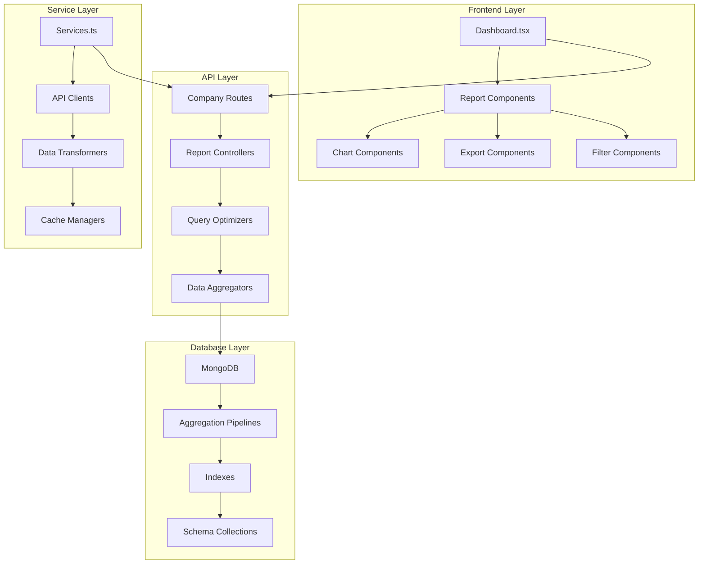
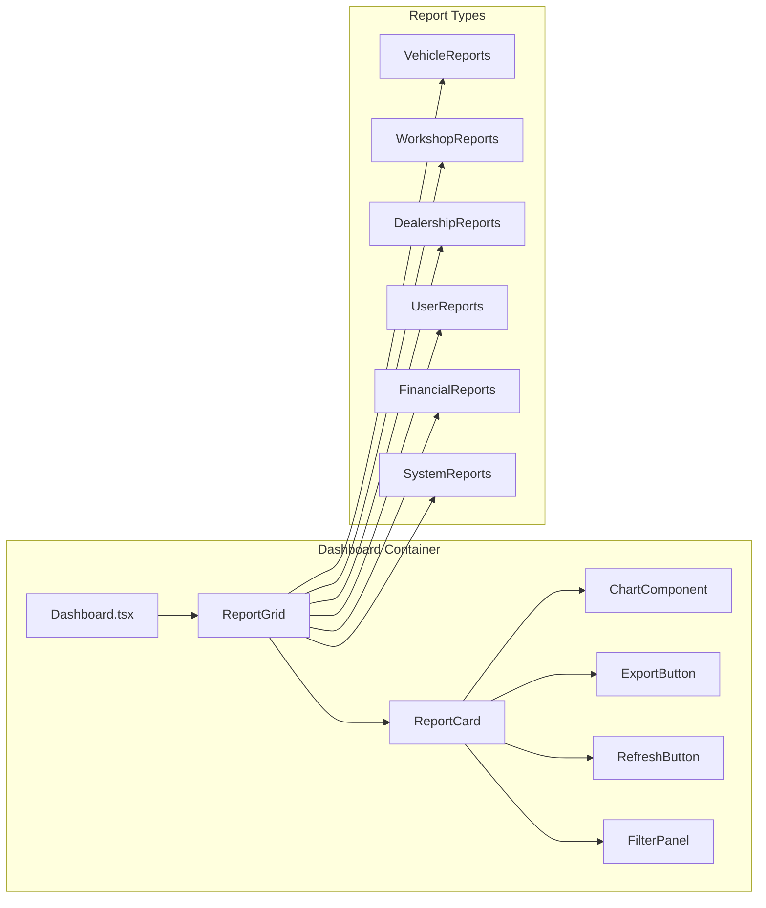

# Advanced Dashboard Analytics System - Design Document

## Overview

The Advanced Dashboard Analytics System is a comprehensive business intelligence platform that provides 50+ meaningful reports with deep analytics across all database schemas. The system focuses heavily on workshop operations, quote management, and vehicle lifecycle analytics while providing detailed dealership-wise insights. It implements role-based access control, optimized database queries, and modern visualization components.

## Architecture

### High-Level Architecture



### Component Architecture



## Components and Interfaces

### Backend Controllers Structure

#### Backend Architecture - Separate Controller Files

The backend will be organized into separate controller files for each schema, promoting modularity and maintainability:

```
backend/src/controllers/reports/
├── vehicle.report.controller.js          (12 report endpoints)
├── masterVehicle.report.controller.js    (5 report endpoints)
├── advertiseVehicle.report.controller.js (5 report endpoints)
├── workshopQuote.report.controller.js    (12 report endpoints)
├── workshopReport.report.controller.js   (8 report endpoints)
├── dealership.report.controller.js       (6 report endpoints)
├── user.report.controller.js             (5 report endpoints)
├── supplier.report.controller.js         (4 report endpoints)
├── serviceBay.report.controller.js       (4 report endpoints)
├── conversation.report.controller.js     (3 report endpoints)
├── costConfiguration.report.controller.js (3 report endpoints)
├── dropdownMaster.report.controller.js   (3 report endpoints)
├── inspectionConfig.report.controller.js (3 report endpoints)
├── tradeinConfig.report.controller.js    (3 report endpoints)
├── integration.report.controller.js      (3 report endpoints)
├── notificationConfig.report.controller.js (3 report endpoints)
├── groupPermission.report.controller.js  (2 report endpoints)
└── workflow.report.controller.js         (3 report endpoints)
```

#### 1. Vehicle Report Controller (vehicle.report.controller.js)

```javascript
// backend/src/controllers/reports/vehicle.report.controller.js
const Vehicle = require('../../models/Vehicle');
const { getDealershipFilter, getDateFilter } = require('../../utils/reportHelpers');

// 1. Vehicle Overview by Type
const getVehicleOverviewByType = async (req, res) => {
  try {
    const { company_id } = req.user;
    const dealershipFilter = getDealershipFilter(req.user);
    const dateFilter = getDateFilter(req.query);

    const pipeline = [
      { $match: { company_id, ...dealershipFilter, ...dateFilter } },
      {
        $group: {
          _id: '$vehicle_type',
          count: { $sum: 1 },
          avgRetailPrice: { $avg: { $arrayElemAt: ['$vehicle_other_details.retail_price', 0] } }
        }
      }
    ];

    const results = await Vehicle.aggregate(pipeline);
    
    res.json({
      success: true,
      data: {
        byType: results,
        totalVehicles: results.reduce((sum, item) => sum + item.count, 0)
      }
    });
  } catch (error) {
    res.status(500).json({ success: false, message: error.message });
  }
};

// 2. Vehicle Pricing Analysis
const getVehiclePricingAnalysis = async (req, res) => {
  try {
    const { company_id } = req.user;
    const dealershipFilter = getDealershipFilter(req.user);

    const pipeline = [
      { $match: { company_id, ...dealershipFilter } },
      { $unwind: { path: '$vehicle_other_details', preserveNullAndEmptyArrays: true } },
      {
        $group: {
          _id: '$vehicle_type',
          avgPurchasePrice: { $avg: '$vehicle_other_details.purchase_price' },
          avgRetailPrice: { $avg: '$vehicle_other_details.retail_price' },
          avgSoldPrice: { $avg: '$vehicle_other_details.sold_price' },
          totalRevenue: { $sum: '$vehicle_other_details.sold_price' }
        }
      }
    ];

    const results = await Vehicle.aggregate(pipeline);
    res.json({ success: true, data: results });
  } catch (error) {
    res.status(500).json({ success: false, message: error.message });
  }
};

// 3-12: Additional vehicle report controllers...
const getVehicleStatusDistribution = async (req, res) => { /* Implementation */ };
const getVehicleWorkshopIntegration = async (req, res) => { /* Implementation */ };
const getVehicleAttachmentAnalysis = async (req, res) => { /* Implementation */ };
const getVehicleRegistrationCompliance = async (req, res) => { /* Implementation */ };
const getVehicleImportTimeline = async (req, res) => { /* Implementation */ };
const getVehicleEngineSpecifications = async (req, res) => { /* Implementation */ };
const getVehicleOdometerTrends = async (req, res) => { /* Implementation */ };
const getVehicleOwnershipHistory = async (req, res) => { /* Implementation */ };
const getVehicleQueueProcessing = async (req, res) => { /* Implementation */ };
const getVehicleCostDetails = async (req, res) => { /* Implementation */ };

module.exports = {
  getVehicleOverviewByType,
  getVehiclePricingAnalysis,
  getVehicleStatusDistribution,
  getVehicleWorkshopIntegration,
  getVehicleAttachmentAnalysis,
  getVehicleRegistrationCompliance,
  getVehicleImportTimeline,
  getVehicleEngineSpecifications,
  getVehicleOdometerTrends,
  getVehicleOwnershipHistory,
  getVehicleQueueProcessing,
  getVehicleCostDetails
};
```

#### 2. MasterVehicle Report Controller (masterVehicle.report.controller.js)

```javascript
// backend/src/controllers/reports/masterVehicle.report.controller.js
const MasterVehicle = require('../../models/MasterVehicle');
const { getDealershipFilter, getDateFilter } = require('../../utils/reportHelpers');

const getMasterVehicleInventory = async (req, res) => { /* Implementation */ };
const getMasterVehicleSpecifications = async (req, res) => { /* Implementation */ };
const getMasterVehicleSourceAnalysis = async (req, res) => { /* Implementation */ };
const getMasterVehicleWorkshopStatus = async (req, res) => { /* Implementation */ };
const getMasterVehiclePricingStrategy = async (req, res) => { /* Implementation */ };

module.exports = {
  getMasterVehicleInventory,
  getMasterVehicleSpecifications,
  getMasterVehicleSourceAnalysis,
  getMasterVehicleWorkshopStatus,
  getMasterVehiclePricingStrategy
};
```

#### 3. AdvertiseVehicle Report Controller (advertiseVehicle.report.controller.js)

```javascript
// backend/src/controllers/reports/advertiseVehicle.report.controller.js
const AdvertiseVehicle = require('../../models/AdvertiseVehicle');

const getAdvertisementPerformance = async (req, res) => { /* Implementation */ };
const getAdvertisementPricingAnalysis = async (req, res) => { /* Implementation */ };
const getAdvertisementAttachmentQuality = async (req, res) => { /* Implementation */ };
const getAdvertisementStatusTracking = async (req, res) => { /* Implementation */ };
const getAdvertisementConversionRates = async (req, res) => { /* Implementation */ };

module.exports = {
  getAdvertisementPerformance,
  getAdvertisementPricingAnalysis,
  getAdvertisementAttachmentQuality,
  getAdvertisementStatusTracking,
  getAdvertisementConversionRates
};
```

#### 4. WorkshopQuote Report Controller (workshopQuote.report.controller.js)

```javascript
// backend/src/controllers/reports/workshopQuote.report.controller.js
const WorkshopQuote = require('../../models/WorkshopQuote');
const Supplier = require('../../models/Supplier');

const getQuoteOverviewByStatus = async (req, res) => { /* Implementation */ };
const getQuoteLifecycleAnalysis = async (req, res) => { /* Implementation */ };
const getQuoteSupplierPerformance = async (req, res) => { /* Implementation */ };
const getQuoteCostAnalysis = async (req, res) => { /* Implementation */ };
const getQuoteApprovalRates = async (req, res) => { /* Implementation */ };
const getQuoteResponseTimeAnalysis = async (req, res) => { /* Implementation */ };
const getQuoteTypeDistribution = async (req, res) => { /* Implementation */ };
const getQuoteBayBookingAnalysis = async (req, res) => { /* Implementation */ };
const getQuoteWorkEntryAnalysis = async (req, res) => { /* Implementation */ };
const getQuoteInvoiceAccuracy = async (req, res) => { /* Implementation */ };
const getQuoteReworkPatterns = async (req, res) => { /* Implementation */ };
const getQuoteConversationMetrics = async (req, res) => { /* Implementation */ };

module.exports = {
  getQuoteOverviewByStatus,
  getQuoteLifecycleAnalysis,
  getQuoteSupplierPerformance,
  getQuoteCostAnalysis,
  getQuoteApprovalRates,
  getQuoteResponseTimeAnalysis,
  getQuoteTypeDistribution,
  getQuoteBayBookingAnalysis,
  getQuoteWorkEntryAnalysis,
  getQuoteInvoiceAccuracy,
  getQuoteReworkPatterns,
  getQuoteConversationMetrics
};
```

#### 5. WorkshopReport Report Controller (workshopReport.report.controller.js)

```javascript
// backend/src/controllers/reports/workshopReport.report.controller.js
const WorkshopReport = require('../../models/WorkshopReport');

const getWorkshopReportOverview = async (req, res) => { /* Implementation */ };
const getWorkshopCostBreakdown = async (req, res) => { /* Implementation */ };
const getWorkshopQualityMetrics = async (req, res) => { /* Implementation */ };
const getWorkshopTechnicianPerformance = async (req, res) => { /* Implementation */ };
const getWorkshopSupplierScorecard = async (req, res) => { /* Implementation */ };
const getWorkshopWarrantyTracking = async (req, res) => { /* Implementation */ };
const getWorkshopCompletionTimeAnalysis = async (req, res) => { /* Implementation */ };
const getWorkshopRevenueAnalysis = async (req, res) => { /* Implementation */ };

module.exports = {
  getWorkshopReportOverview,
  getWorkshopCostBreakdown,
  getWorkshopQualityMetrics,
  getWorkshopTechnicianPerformance,
  getWorkshopSupplierScorecard,
  getWorkshopWarrantyTracking,
  getWorkshopCompletionTimeAnalysis,
  getWorkshopRevenueAnalysis
};
```

#### 6-18. Additional Report Controllers

Similar structure for:
- `dealership.report.controller.js` (6 reports)
- `user.report.controller.js` (5 reports)
- `supplier.report.controller.js` (4 reports)
- `serviceBay.report.controller.js` (4 reports)
- `conversation.report.controller.js` (3 reports)
- `costConfiguration.report.controller.js` (3 reports)
- `dropdownMaster.report.controller.js` (3 reports)
- `inspectionConfig.report.controller.js` (3 reports)
- `tradeinConfig.report.controller.js` (3 reports)
- `integration.report.controller.js` (3 reports)
- `notificationConfig.report.controller.js` (3 reports)
- `groupPermission.report.controller.js` (2 reports)
- `workflow.report.controller.js` (3 reports)

#### Routes Integration (company.routes.js)

```javascript
// backend/src/routes/company.routes.js
const express = require('express');
const { protect, authorize, companyScopeCheck } = require('../middleware/auth');

// Import all report controllers
const vehicleReports = require('../controllers/reports/vehicle.report.controller');
const masterVehicleReports = require('../controllers/reports/masterVehicle.report.controller');
const advertiseVehicleReports = require('../controllers/reports/advertiseVehicle.report.controller');
const workshopQuoteReports = require('../controllers/reports/workshopQuote.report.controller');
const workshopReportReports = require('../controllers/reports/workshopReport.report.controller');
const dealershipReports = require('../controllers/reports/dealership.report.controller');
const userReports = require('../controllers/reports/user.report.controller');
const supplierReports = require('../controllers/reports/supplier.report.controller');
const serviceBayReports = require('../controllers/reports/serviceBay.report.controller');
const conversationReports = require('../controllers/reports/conversation.report.controller');
const costConfigReports = require('../controllers/reports/costConfiguration.report.controller');
const dropdownMasterReports = require('../controllers/reports/dropdownMaster.report.controller');
const inspectionConfigReports = require('../controllers/reports/inspectionConfig.report.controller');
const tradeinConfigReports = require('../controllers/reports/tradeinConfig.report.controller');
const integrationReports = require('../controllers/reports/integration.report.controller');
const notificationConfigReports = require('../controllers/reports/notificationConfig.report.controller');
const groupPermissionReports = require('../controllers/reports/groupPermission.report.controller');
const workflowReports = require('../controllers/reports/workflow.report.controller');

const router = express.Router();

// Apply auth middleware to all routes
router.use(protect);
router.use(authorize('company_super_admin', 'company_admin'));
router.use(companyScopeCheck);

// Vehicle Reports (12 endpoints)
router.get('/reports/vehicle/overview-by-type', vehicleReports.getVehicleOverviewByType);
router.get('/reports/vehicle/pricing-analysis', vehicleReports.getVehiclePricingAnalysis);
router.get('/reports/vehicle/status-distribution', vehicleReports.getVehicleStatusDistribution);
router.get('/reports/vehicle/workshop-integration', vehicleReports.getVehicleWorkshopIntegration);
router.get('/reports/vehicle/attachment-analysis', vehicleReports.getVehicleAttachmentAnalysis);
router.get('/reports/vehicle/registration-compliance', vehicleReports.getVehicleRegistrationCompliance);
router.get('/reports/vehicle/import-timeline', vehicleReports.getVehicleImportTimeline);
router.get('/reports/vehicle/engine-specifications', vehicleReports.getVehicleEngineSpecifications);
router.get('/reports/vehicle/odometer-trends', vehicleReports.getVehicleOdometerTrends);
router.get('/reports/vehicle/ownership-history', vehicleReports.getVehicleOwnershipHistory);
router.get('/reports/vehicle/queue-processing', vehicleReports.getVehicleQueueProcessing);
router.get('/reports/vehicle/cost-details', vehicleReports.getVehicleCostDetails);

// MasterVehicle Reports (5 endpoints)
router.get('/reports/master-vehicle/inventory', masterVehicleReports.getMasterVehicleInventory);
router.get('/reports/master-vehicle/specifications', masterVehicleReports.getMasterVehicleSpecifications);
router.get('/reports/master-vehicle/source-analysis', masterVehicleReports.getMasterVehicleSourceAnalysis);
router.get('/reports/master-vehicle/workshop-status', masterVehicleReports.getMasterVehicleWorkshopStatus);
router.get('/reports/master-vehicle/pricing-strategy', masterVehicleReports.getMasterVehiclePricingStrategy);

// AdvertiseVehicle Reports (5 endpoints)
router.get('/reports/advertise-vehicle/performance', advertiseVehicleReports.getAdvertisementPerformance);
router.get('/reports/advertise-vehicle/pricing-analysis', advertiseVehicleReports.getAdvertisementPricingAnalysis);
router.get('/reports/advertise-vehicle/attachment-quality', advertiseVehicleReports.getAdvertisementAttachmentQuality);
router.get('/reports/advertise-vehicle/status-tracking', advertiseVehicleReports.getAdvertisementStatusTracking);
router.get('/reports/advertise-vehicle/conversion-rates', advertiseVehicleReports.getAdvertisementConversionRates);

// WorkshopQuote Reports (12 endpoints)
router.get('/reports/workshop-quote/overview-by-status', workshopQuoteReports.getQuoteOverviewByStatus);
router.get('/reports/workshop-quote/lifecycle-analysis', workshopQuoteReports.getQuoteLifecycleAnalysis);
router.get('/reports/workshop-quote/supplier-performance', workshopQuoteReports.getQuoteSupplierPerformance);
router.get('/reports/workshop-quote/cost-analysis', workshopQuoteReports.getQuoteCostAnalysis);
router.get('/reports/workshop-quote/approval-rates', workshopQuoteReports.getQuoteApprovalRates);
router.get('/reports/workshop-quote/response-time-analysis', workshopQuoteReports.getQuoteResponseTimeAnalysis);
router.get('/reports/workshop-quote/type-distribution', workshopQuoteReports.getQuoteTypeDistribution);
router.get('/reports/workshop-quote/bay-booking-analysis', workshopQuoteReports.getQuoteBayBookingAnalysis);
router.get('/reports/workshop-quote/work-entry-analysis', workshopQuoteReports.getQuoteWorkEntryAnalysis);
router.get('/reports/workshop-quote/invoice-accuracy', workshopQuoteReports.getQuoteInvoiceAccuracy);
router.get('/reports/workshop-quote/rework-patterns', workshopQuoteReports.getQuoteReworkPatterns);
router.get('/reports/workshop-quote/conversation-metrics', workshopQuoteReports.getQuoteConversationMetrics);

// WorkshopReport Reports (8 endpoints)
router.get('/reports/workshop-report/overview', workshopReportReports.getWorkshopReportOverview);
router.get('/reports/workshop-report/cost-breakdown', workshopReportReports.getWorkshopCostBreakdown);
router.get('/reports/workshop-report/quality-metrics', workshopReportReports.getWorkshopQualityMetrics);
router.get('/reports/workshop-report/technician-performance', workshopReportReports.getWorkshopTechnicianPerformance);
router.get('/reports/workshop-report/supplier-scorecard', workshopReportReports.getWorkshopSupplierScorecard);
router.get('/reports/workshop-report/warranty-tracking', workshopReportReports.getWorkshopWarrantyTracking);
router.get('/reports/workshop-report/completion-time-analysis', workshopReportReports.getWorkshopCompletionTimeAnalysis);
router.get('/reports/workshop-report/revenue-analysis', workshopReportReports.getWorkshopRevenueAnalysis);

// Dealership Reports (6 endpoints)
router.get('/reports/dealership/overview', dealershipReports.getDealershipOverview);
router.get('/reports/dealership/vehicle-distribution', dealershipReports.getDealershipVehicleDistribution);
router.get('/reports/dealership/workshop-performance', dealershipReports.getDealershipWorkshopPerformance);
router.get('/reports/dealership/user-activity', dealershipReports.getDealershipUserActivity);
router.get('/reports/dealership/revenue-comparison', dealershipReports.getDealershipRevenueComparison);
router.get('/reports/dealership/service-bay-utilization', dealershipReports.getDealershipServiceBayUtilization);

// User Reports (5 endpoints)
router.get('/reports/user/performance-metrics', userReports.getUserPerformanceMetrics);
router.get('/reports/user/login-patterns', userReports.getUserLoginPatterns);
router.get('/reports/user/role-distribution', userReports.getUserRoleDistribution);
router.get('/reports/user/dealership-assignment', userReports.getUserDealershipAssignment);
router.get('/reports/user/permission-utilization', userReports.getUserPermissionUtilization);

// Supplier Reports (4 endpoints)
router.get('/reports/supplier/overview', supplierReports.getSupplierOverview);
router.get('/reports/supplier/performance-ranking', supplierReports.getSupplierPerformanceRanking);
router.get('/reports/supplier/tag-analysis', supplierReports.getSupplierTagAnalysis);
router.get('/reports/supplier/relationship-metrics', supplierReports.getSupplierRelationshipMetrics);

// ServiceBay Reports (4 endpoints)
router.get('/reports/service-bay/utilization', serviceBayReports.getServiceBayUtilization);
router.get('/reports/service-bay/booking-patterns', serviceBayReports.getServiceBayBookingPatterns);
router.get('/reports/service-bay/user-assignment', serviceBayReports.getServiceBayUserAssignment);
router.get('/reports/service-bay/holiday-impact', serviceBayReports.getServiceBayHolidayImpact);

// Conversation Reports (3 endpoints)
router.get('/reports/conversation/volume-analysis', conversationReports.getConversationVolumeAnalysis);
router.get('/reports/conversation/response-times', conversationReports.getConversationResponseTimes);
router.get('/reports/conversation/engagement-metrics', conversationReports.getConversationEngagementMetrics);

// CostConfiguration Reports (3 endpoints)
router.get('/reports/cost-configuration/type-utilization', costConfigReports.getCostTypeUtilization);
router.get('/reports/cost-configuration/setter-effectiveness', costConfigReports.getCostSetterEffectiveness);
router.get('/reports/cost-configuration/currency-distribution', costConfigReports.getCostCurrencyDistribution);

// DropdownMaster Reports (3 endpoints)
router.get('/reports/dropdown-master/usage-analysis', dropdownMasterReports.getDropdownUsageAnalysis);
router.get('/reports/dropdown-master/value-distribution', dropdownMasterReports.getDropdownValueDistribution);
router.get('/reports/dropdown-master/configuration-health', dropdownMasterReports.getDropdownConfigurationHealth);

// InspectionConfig Reports (3 endpoints)
router.get('/reports/inspection-config/usage', inspectionConfigReports.getInspectionConfigUsage);
router.get('/reports/inspection-config/field-analysis', inspectionConfigReports.getInspectionFieldAnalysis);
router.get('/reports/inspection-config/category-effectiveness', inspectionConfigReports.getInspectionCategoryEffectiveness);

// TradeinConfig Reports (3 endpoints)
router.get('/reports/tradein-config/usage', tradeinConfigReports.getTradeinConfigUsage);
router.get('/reports/tradein-config/field-analysis', tradeinConfigReports.getTradeinFieldAnalysis);
router.get('/reports/tradein-config/category-effectiveness', tradeinConfigReports.getTradeinCategoryEffectiveness);

// Integration Reports (3 endpoints)
router.get('/reports/integration/status-overview', integrationReports.getIntegrationStatusOverview);
router.get('/reports/integration/environment-usage', integrationReports.getIntegrationEnvironmentUsage);
router.get('/reports/integration/type-distribution', integrationReports.getIntegrationTypeDistribution);

// NotificationConfiguration Reports (3 endpoints)
router.get('/reports/notification-config/engagement-metrics', notificationConfigReports.getNotificationEngagementMetrics);
router.get('/reports/notification-config/trigger-analysis', notificationConfigReports.getNotificationTriggerAnalysis);
router.get('/reports/notification-config/channel-performance', notificationConfigReports.getNotificationChannelPerformance);

// GroupPermission Reports (2 endpoints)
router.get('/reports/group-permission/usage', groupPermissionReports.getGroupPermissionUsage);
router.get('/reports/group-permission/effectiveness', groupPermissionReports.getGroupPermissionEffectiveness);

// Workflow Reports (3 endpoints)
router.get('/reports/workflow/execution-metrics', workflowReports.getWorkflowExecutionMetrics);
router.get('/reports/workflow/type-distribution', workflowReports.getWorkflowTypeDistribution);
router.get('/reports/workflow/success-rates', workflowReports.getWorkflowSuccessRates);

module.exports = router;
```

#### Report Helper Utilities (reportHelpers.js)

```javascript
// backend/src/utils/reportHelpers.js

/**
 * Get dealership filter based on user role and permissions
 */
const getDealershipFilter = (user) => {
  // Primary admin sees all dealerships
  if (user.is_primary_admin) {
    return {};
  }
  
  // Non-primary company_super_admin sees only assigned dealerships
  if (user.role === 'company_super_admin' && user.dealership_ids && user.dealership_ids.length > 0) {
    return { dealership_id: { $in: user.dealership_ids } };
  }
  
  return {};
};

/**
 * Get date filter from query parameters
 */
const getDateFilter = (query) => {
  const { from, to } = query;
  
  if (!from || !to) {
    return {};
  }
  
  return {
    created_at: {
      $gte: new Date(from),
      $lte: new Date(to)
    }
  };
};

/**
 * Format response with metadata
 */
const formatReportResponse = (data, metadata = {}) => {
  return {
    success: true,
    data,
    metadata: {
      generatedAt: new Date(),
      totalRecords: Array.isArray(data) ? data.length : 1,
      ...metadata
    }
  };
};

/**
 * Handle report controller errors
 */
const handleReportError = (error, res, reportName = '') => {
  console.error(`Report Error [${reportName}]:`, error);
  
  return res.status(500).json({
    success: false,
    message: `Error generating ${reportName} report`,
    error: process.env.NODE_ENV === 'development' ? error.message : undefined
  });
};

/**
 * Build aggregation pipeline with common stages
 */
const buildBasePipeline = (user, query) => {
  const pipeline = [];
  
  // Company filter
  pipeline.push({
    $match: { company_id: user.company_id }
  });
  
  // Dealership filter
  const dealershipFilter = getDealershipFilter(user);
  if (Object.keys(dealershipFilter).length > 0) {
    pipeline.push({ $match: dealershipFilter });
  }
  
  // Date filter
  const dateFilter = getDateFilter(query);
  if (Object.keys(dateFilter).length > 0) {
    pipeline.push({ $match: dateFilter });
  }
  
  return pipeline;
};

module.exports = {
  getDealershipFilter,
  getDateFilter,
  formatReportResponse,
  handleReportError,
  buildBasePipeline
};
```

#### 2. Optimized Query Structure

```javascript
// Example of optimized aggregation pipeline
const getWorkshopPerformanceAnalysis = async (req, res) => {
  try {
    const { dealership_ids, from, to } = getFilterParams(req);
    
    const pipeline = [
      // Match stage with proper indexing
      {
        $match: {
          company_id: req.user.company_id,
          ...(dealership_ids && { dealership_id: { $in: dealership_ids } }),
          ...(from && to && { created_at: { $gte: new Date(from), $lte: new Date(to) } })
        }
      },
      
      // Lookup related collections
      {
        $lookup: {
          from: "workshopreports",
          localField: "_id",
          foreignField: "quote_id",
          as: "workshop_reports"
        }
      },
      
      // Complex aggregation with multiple groupings
      {
        $group: {
          _id: {
            dealership: "$dealership_id",
            status: "$status",
            supplier: "$approved_supplier"
          },
          count: { $sum: 1 },
          avgCost: { $avg: "$quote_amount" },
          totalRevenue: { $sum: "$comment_sheet.final_price" },
          avgCompletionTime: { $avg: { $subtract: ["$work_completed_at", "$created_at"] } }
        }
      },
      
      // Final projection and sorting
      {
        $sort: { totalRevenue: -1 }
      }
    ];
    
    const results = await WorkshopQuote.aggregate(pipeline);
    
    res.json({
      success: true,
      data: transformWorkshopData(results),
      metadata: {
        totalRecords: results.length,
        generatedAt: new Date(),
        filters: { dealership_ids, from, to }
      }
    });
  } catch (error) {
    handleControllerError(error, res);
  }
};
```

### Frontend Component Structure

#### 1. Report Component Interface

```typescript
interface ReportComponentProps {
  title: string;
  reportType: string;
  dealershipFilter?: string[];
  dateRange?: DateRange;
  refreshTrigger?: number;
  exportEnabled?: boolean;
  chartType?: 'pie' | 'bar' | 'line' | 'area' | 'table';
  loading?: boolean;
}

interface ReportData {
  data: any[];
  metadata: {
    totalRecords: number;
    generatedAt: string;
    filters: any;
  };
  chartConfig: ChartConfiguration;
}
```

#### 2. Complete Dashboard Layout with All Report Components

```typescript
// Dashboard.tsx main structure with ALL 50+ report components
const Dashboard: React.FC = () => {
  const { completeUser } = useAuth();
  const [reportFilters, setReportFilters] = useState<ReportFilters>();
  const [refreshTrigger, setRefreshTrigger] = useState(0);
  
  const isDealershipFiltered = useMemo(() => 
    completeUser?.role === 'company_super_admin' && !completeUser?.is_primary_admin
  , [completeUser]);
  
  const dealershipIds = useMemo(() => 
    isDealershipFiltered ? completeUser?.dealership_ids : null
  , [isDealershipFiltered, completeUser]);

  const commonProps = {
    dealershipIds,
    dateRange: reportFilters?.dateRange,
    refreshTrigger,
    exportEnabled: true
  };

  return (
    <DashboardContainer>
      <DashboardHeader>
        <FilterPanel onFiltersChange={setReportFilters} />
        <GlobalActions onRefresh={() => setRefreshTrigger(prev => prev + 1)} />
      </DashboardHeader>
      
      <ReportGrid>
        {/* Vehicle Schema Reports (12 components) */}
        <ReportSection title="Vehicle Analytics" icon="🚗">
          <VehicleOverviewByTypeReport {...commonProps} />
          <VehiclePricingAnalysisReport {...commonProps} />
          <VehicleStatusDistributionReport {...commonProps} />
          <VehicleWorkshopIntegrationReport {...commonProps} />
          <VehicleAttachmentAnalysisReport {...commonProps} />
          <VehicleRegistrationComplianceReport {...commonProps} />
          <VehicleImportTimelineReport {...commonProps} />
          <VehicleEngineSpecificationsReport {...commonProps} />
          <VehicleOdometerTrendsReport {...commonProps} />
          <VehicleOwnershipHistoryReport {...commonProps} />
          <VehicleQueueProcessingReport {...commonProps} />
          <VehicleCostDetailsReport {...commonProps} />
        </ReportSection>
        
        {/* MasterVehicle Schema Reports (5 components) */}
        <ReportSection title="Master Vehicle Analytics" icon="📋">
          <MasterVehicleInventoryReport {...commonProps} />
          <MasterVehicleSpecificationsReport {...commonProps} />
          <MasterVehicleSourceAnalysisReport {...commonProps} />
          <MasterVehicleWorkshopStatusReport {...commonProps} />
          <MasterVehiclePricingStrategyReport {...commonProps} />
        </ReportSection>
        
        {/* AdvertiseVehicle Schema Reports (5 components) */}
        <ReportSection title="Advertisement Vehicle Analytics" icon="📢">
          <AdvertisementPerformanceReport {...commonProps} />
          <AdvertisementPricingAnalysisReport {...commonProps} />
          <AdvertisementAttachmentQualityReport {...commonProps} />
          <AdvertisementStatusTrackingReport {...commonProps} />
          <AdvertisementConversionRatesReport {...commonProps} />
        </ReportSection>
        
        {/* WorkshopQuote Schema Reports (12 components) */}
        <ReportSection title="Workshop Quote Analytics" icon="💰">
          <QuoteOverviewByStatusReport {...commonProps} />
          <QuoteLifecycleAnalysisReport {...commonProps} />
          <QuoteSupplierPerformanceReport {...commonProps} />
          <QuoteCostAnalysisReport {...commonProps} />
          <QuoteApprovalRatesReport {...commonProps} />
          <QuoteResponseTimeAnalysisReport {...commonProps} />
          <QuoteTypeDistributionReport {...commonProps} />
          <QuoteBayBookingAnalysisReport {...commonProps} />
          <QuoteWorkEntryAnalysisReport {...commonProps} />
          <QuoteInvoiceAccuracyReport {...commonProps} />
          <QuoteReworkPatternsReport {...commonProps} />
          <QuoteConversationMetricsReport {...commonProps} />
        </ReportSection>
        
        {/* WorkshopReport Schema Reports (8 components) */}
        <ReportSection title="Workshop Report Analytics" icon="🔧">
          <WorkshopReportOverviewReport {...commonProps} />
          <WorkshopCostBreakdownReport {...commonProps} />
          <WorkshopQualityMetricsReport {...commonProps} />
          <WorkshopTechnicianPerformanceReport {...commonProps} />
          <WorkshopSupplierScorecardReport {...commonProps} />
          <WorkshopWarrantyTrackingReport {...commonProps} />
          <WorkshopCompletionTimeAnalysisReport {...commonProps} />
          <WorkshopRevenueAnalysisReport {...commonProps} />
        </ReportSection>
        
        {/* Dealership Schema Reports (6 components) */}
        <ReportSection title="Dealership Analytics" icon="🏢">
          <DealershipOverviewReport {...commonProps} />
          <DealershipVehicleDistributionReport {...commonProps} />
          <DealershipWorkshopPerformanceReport {...commonProps} />
          <DealershipUserActivityReport {...commonProps} />
          <DealershipRevenueComparisonReport {...commonProps} />
          <DealershipServiceBayUtilizationReport {...commonProps} />
        </ReportSection>
        
        {/* User Schema Reports (5 components) */}
        <ReportSection title="User Analytics" icon="👥">
          <UserPerformanceMetricsReport {...commonProps} />
          <UserLoginPatternsReport {...commonProps} />
          <UserRoleDistributionReport {...commonProps} />
          <UserDealershipAssignmentReport {...commonProps} />
          <UserPermissionUtilizationReport {...commonProps} />
        </ReportSection>
        
        {/* Supplier Schema Reports (4 components) */}
        <ReportSection title="Supplier Analytics" icon="🤝">
          <SupplierOverviewReport {...commonProps} />
          <SupplierPerformanceRankingReport {...commonProps} />
          <SupplierTagAnalysisReport {...commonProps} />
          <SupplierRelationshipMetricsReport {...commonProps} />
        </ReportSection>
        
        {/* ServiceBay Schema Reports (4 components) */}
        <ReportSection title="Service Bay Analytics" icon="🔩">
          <ServiceBayUtilizationReport {...commonProps} />
          <ServiceBayBookingPatternsReport {...commonProps} />
          <ServiceBayUserAssignmentReport {...commonProps} />
          <ServiceBayHolidayImpactReport {...commonProps} />
        </ReportSection>
        
        {/* Conversation Schema Reports (3 components) */}
        <ReportSection title="Communication Analytics" icon="💬">
          <ConversationVolumeAnalysisReport {...commonProps} />
          <ConversationResponseTimesReport {...commonProps} />
          <ConversationEngagementMetricsReport {...commonProps} />
        </ReportSection>
        
        {/* CostConfiguration Schema Reports (3 components) */}
        <ReportSection title="Cost Configuration Analytics" icon="💵">
          <CostTypeUtilizationReport {...commonProps} />
          <CostSetterEffectivenessReport {...commonProps} />
          <CostCurrencyDistributionReport {...commonProps} />
        </ReportSection>
        
        {/* DropdownMaster Schema Reports (3 components) */}
        <ReportSection title="Dropdown Configuration Analytics" icon="📝">
          <DropdownUsageAnalysisReport {...commonProps} />
          <DropdownValueDistributionReport {...commonProps} />
          <DropdownConfigurationHealthReport {...commonProps} />
        </ReportSection>
        
        {/* InspectionConfig Schema Reports (3 components) */}
        <ReportSection title="Inspection Configuration Analytics" icon="🔍">
          <InspectionConfigUsageReport {...commonProps} />
          <InspectionFieldAnalysisReport {...commonProps} />
          <InspectionCategoryEffectivenessReport {...commonProps} />
        </ReportSection>
        
        {/* TradeinConfig Schema Reports (3 components) */}
        <ReportSection title="Trade-in Configuration Analytics" icon="🔄">
          <TradeinConfigUsageReport {...commonProps} />
          <TradeinFieldAnalysisReport {...commonProps} />
          <TradeinCategoryEffectivenessReport {...commonProps} />
        </ReportSection>
        
        {/* Integration Schema Reports (3 components) */}
        <ReportSection title="Integration Analytics" icon="🔌">
          <IntegrationStatusOverviewReport {...commonProps} />
          <IntegrationEnvironmentUsageReport {...commonProps} />
          <IntegrationTypeDistributionReport {...commonProps} />
        </ReportSection>
        
        {/* NotificationConfiguration Schema Reports (3 components) */}
        <ReportSection title="Notification Analytics" icon="🔔">
          <NotificationEngagementMetricsReport {...commonProps} />
          <NotificationTriggerAnalysisReport {...commonProps} />
          <NotificationChannelPerformanceReport {...commonProps} />
        </ReportSection>
        
        {/* GroupPermission Schema Reports (2 components) */}
        <ReportSection title="Permission Analytics" icon="🔐">
          <GroupPermissionUsageReport {...commonProps} />
          <GroupPermissionEffectivenessReport {...commonProps} />
        </ReportSection>
        
        {/* Workflow Schema Reports (3 components) */}
        <ReportSection title="Workflow Analytics" icon="⚙️">
          <WorkflowExecutionMetricsReport {...commonProps} />
          <WorkflowTypeDistributionReport {...commonProps} />
          <WorkflowSuccessRatesReport {...commonProps} />
        </ReportSection>
      </ReportGrid>
    </DashboardContainer>
  );
};
```

#### 3. Enhanced Interactive Report Component Structure

Each report component features rich, interactive visualizations with comprehensive datasets:

```typescript
// Example: VehicleOverviewByTypeReport.tsx
import React, { useState } from 'react';
import { 
  ReportCard, 
  InteractivePieChart, 
  StackedBarChart, 
  LineChart,
  HeatMap,
  DataTable,
  TrendIndicator,
  ComparisonChart
} from '../common';
import { useReportData } from '../../hooks/useReportData';
import { ExportButton, RefreshButton, FilterButton } from '../common/ReportActions';

interface VehicleOverviewByTypeReportProps {
  dealershipIds?: string[];
  dateRange?: DateRange;
  refreshTrigger?: number;
  exportEnabled?: boolean;
}

export const VehicleOverviewByTypeReport: React.FC<VehicleOverviewByTypeReportProps> = ({
  dealershipIds,
  dateRange,
  refreshTrigger,
  exportEnabled
}) => {
  const [selectedType, setSelectedType] = useState<string | null>(null);
  const [viewMode, setViewMode] = useState<'chart' | 'table'>('chart');
  
  const { data, loading, error, refetch } = useReportData(
    'vehicle-overview-by-type',
    { dealershipIds, dateRange },
    refreshTrigger
  );

  if (loading) return <ReportSkeleton variant="detailed" />;
  if (error) return <ReportError error={error} onRetry={refetch} />;

  return (
    <ReportCard
      title="Vehicle Overview by Type"
      subtitle="Comprehensive distribution analysis across inspection, trade-in, master, and advertisement vehicles"
      actions={
        <>
          <FilterButton onFilter={() => {/* Filter logic */}} />
          <RefreshButton onClick={refetch} loading={loading} />
          {exportEnabled && (
            <ExportButton 
              data={data} 
              reportName="vehicle-overview"
              formats={['csv', 'pdf', 'excel']}
            />
          )}
        </>
      }
      viewToggle={
        <ViewToggle value={viewMode} onChange={setViewMode} />
      }
    >
      {/* Key Metrics Row */}
      <div className="grid grid-cols-4 gap-4 mb-6">
        <MetricCard
          label="Total Vehicles"
          value={data.totalVehicles}
          trend={data.trend}
          trendValue={data.trendPercentage}
          icon="🚗"
          color="blue"
        />
        <MetricCard
          label="Inspection Vehicles"
          value={data.inspectionCount}
          percentage={(data.inspectionCount / data.totalVehicles * 100).toFixed(1)}
          icon="🔍"
          color="green"
          onClick={() => setSelectedType('inspection')}
        />
        <MetricCard
          label="Trade-in Vehicles"
          value={data.tradeinCount}
          percentage={(data.tradeinCount / data.totalVehicles * 100).toFixed(1)}
          icon="🔄"
          color="orange"
          onClick={() => setSelectedType('tradein')}
        />
        <MetricCard
          label="Advertisement Vehicles"
          value={data.advertisementCount}
          percentage={(data.advertisementCount / data.totalVehicles * 100).toFixed(1)}
          icon="📢"
          color="purple"
          onClick={() => setSelectedType('advertisement')}
        />
      </div>

      {viewMode === 'chart' ? (
        <>
          {/* Main Visualization Grid */}
          <div className="grid grid-cols-2 gap-6 mb-6">
            {/* Interactive Pie Chart with Drill-down */}
            <InteractivePieChart
              data={data.byType}
              title="Vehicle Type Distribution"
              subtitle="Click segments for detailed breakdown"
              colors={['#3b82f6', '#10b981', '#f59e0b', '#ef4444', '#8b5cf6']}
              onSegmentClick={(segment) => setSelectedType(segment.type)}
              showLegend
              showPercentages
              animationDuration={800}
            />
            
            {/* Stacked Bar Chart by Status */}
            <StackedBarChart
              data={data.byStatusAndType}
              title="Status Distribution by Type"
              xAxis="status"
              yAxis="count"
              stackBy="type"
              colors={['#3b82f6', '#10b981', '#f59e0b', '#ef4444']}
              interactive
              showTooltip
            />
          </div>

          {/* Trend Analysis */}
          <div className="grid grid-cols-2 gap-6 mb-6">
            {/* Monthly Trend Line Chart */}
            <LineChart
              data={data.monthlyTrend}
              title="Monthly Vehicle Addition Trend"
              xAxis="month"
              yAxis="count"
              lines={[
                { key: 'inspection', color: '#3b82f6', label: 'Inspection' },
                { key: 'tradein', color: '#10b981', label: 'Trade-in' },
                { key: 'advertisement', color: '#f59e0b', label: 'Advertisement' }
              ]}
              showGrid
              showPoints
              interactive
            />
            
            {/* Dealership Comparison */}
            <ComparisonChart
              data={data.byDealership}
              title="Vehicles by Dealership"
              metric="count"
              sortBy="value"
              showPercentage
              maxItems={10}
            />
          </div>

          {/* Heat Map for Time-based Analysis */}
          <div className="mb-6">
            <HeatMap
              data={data.heatMapData}
              title="Vehicle Activity Heat Map"
              subtitle="Day of week vs Hour of day"
              xAxis="hour"
              yAxis="dayOfWeek"
              colorScale={['#f0f9ff', '#0369a1']}
              showValues
            />
          </div>

          {/* Detailed Breakdown Section */}
          {selectedType && (
            <div className="mt-6 p-4 bg-gray-50 rounded-lg">
              <h4 className="text-lg font-semibold mb-4">
                {selectedType.charAt(0).toUpperCase() + selectedType.slice(1)} Vehicle Details
              </h4>
              <div className="grid grid-cols-3 gap-4">
                <StatCard
                  label="Average Price"
                  value={`$${data.detailedBreakdown[selectedType].avgPrice.toLocaleString()}`}
                />
                <StatCard
                  label="Total Revenue"
                  value={`$${data.detailedBreakdown[selectedType].totalRevenue.toLocaleString()}`}
                />
                <StatCard
                  label="Avg Days in System"
                  value={data.detailedBreakdown[selectedType].avgDaysInSystem}
                />
              </div>
              
              {/* Mini charts for selected type */}
              <div className="grid grid-cols-2 gap-4 mt-4">
                <BarChart
                  data={data.detailedBreakdown[selectedType].byMake}
                  title="Top Makes"
                  xAxis="make"
                  yAxis="count"
                  maxBars={5}
                />
                <BarChart
                  data={data.detailedBreakdown[selectedType].byYear}
                  title="Year Distribution"
                  xAxis="year"
                  yAxis="count"
                />
              </div>
            </div>
          )}
        </>
      ) : (
        /* Data Table View */
        <DataTable
          data={data.tableData}
          columns={[
            { key: 'type', label: 'Vehicle Type', sortable: true },
            { key: 'count', label: 'Count', sortable: true },
            { key: 'percentage', label: 'Percentage', sortable: true },
            { key: 'avgPrice', label: 'Avg Price', sortable: true, format: 'currency' },
            { key: 'totalRevenue', label: 'Total Revenue', sortable: true, format: 'currency' },
            { key: 'status', label: 'Status', sortable: true }
          ]}
          pagination
          searchable
          exportable
        />
      )}
    </ReportCard>
  );
};
```

#### 4. Enhanced Controller with Comprehensive Datasets

```javascript
// backend/src/controllers/reports/vehicle.report.controller.js (Enhanced)
const Vehicle = require('../../models/Vehicle');
const { getDealershipFilter, getDateFilter, formatReportResponse } = require('../../utils/reportHelpers');

const getVehicleOverviewByType = async (req, res) => {
  try {
    const { company_id } = req.user;
    const dealershipFilter = getDealershipFilter(req.user);
    const dateFilter = getDateFilter(req.query);

    // Main aggregation for type distribution
    const typeDistribution = await Vehicle.aggregate([
      { $match: { company_id, ...dealershipFilter, ...dateFilter } },
      {
        $group: {
          _id: '$vehicle_type',
          count: { $sum: 1 },
          avgRetailPrice: { $avg: { $arrayElemAt: ['$vehicle_other_details.retail_price', 0] } },
          avgPurchasePrice: { $avg: { $arrayElemAt: ['$vehicle_other_details.purchase_price', 0] } },
          totalRevenue: { $sum: { $arrayElemAt: ['$vehicle_other_details.sold_price', 0] } }
        }
      }
    ]);

    // Status distribution by type
    const statusByType = await Vehicle.aggregate([
      { $match: { company_id, ...dealershipFilter, ...dateFilter } },
      {
        $group: {
          _id: { status: '$status', type: '$vehicle_type' },
          count: { $sum: 1 }
        }
      }
    ]);

    // Monthly trend analysis
    const monthlyTrend = await Vehicle.aggregate([
      { $match: { company_id, ...dealershipFilter, ...dateFilter } },
      {
        $group: {
          _id: {
            month: { $month: '$created_at' },
            year: { $year: '$created_at' },
            type: '$vehicle_type'
          },
          count: { $sum: 1 }
        }
      },
      { $sort: { '_id.year': 1, '_id.month': 1 } }
    ]);

    // Dealership comparison
    const byDealership = await Vehicle.aggregate([
      { $match: { company_id, ...dealershipFilter, ...dateFilter } },
      {
        $group: {
          _id: '$dealership_id',
          count: { $sum: 1 },
          types: {
            $push: {
              type: '$vehicle_type',
              price: { $arrayElemAt: ['$vehicle_other_details.retail_price', 0] }
            }
          }
        }
      },
      {
        $lookup: {
          from: 'dealerships',
          localField: '_id',
          foreignField: 'dealership_id',
          as: 'dealership_info'
        }
      },
      { $sort: { count: -1 } }
    ]);

    // Heat map data (day of week vs hour)
    const heatMapData = await Vehicle.aggregate([
      { $match: { company_id, ...dealershipFilter, ...dateFilter } },
      {
        $group: {
          _id: {
            dayOfWeek: { $dayOfWeek: '$created_at' },
            hour: { $hour: '$created_at' }
          },
          count: { $sum: 1 }
        }
      }
    ]);

    // Detailed breakdown for each type
    const detailedBreakdown = {};
    for (const type of ['inspection', 'tradein', 'advertisement', 'master']) {
      const typeData = await Vehicle.aggregate([
        { $match: { company_id, vehicle_type: type, ...dealershipFilter, ...dateFilter } },
        {
          $facet: {
            byMake: [
              { $group: { _id: '$make', count: { $sum: 1 } } },
              { $sort: { count: -1 } },
              { $limit: 10 }
            ],
            byYear: [
              { $group: { _id: '$year', count: { $sum: 1 } } },
              { $sort: { _id: -1 } }
            ],
            avgMetrics: [
              {
                $group: {
                  _id: null,
                  avgPrice: { $avg: { $arrayElemAt: ['$vehicle_other_details.retail_price', 0] } },
                  totalRevenue: { $sum: { $arrayElemAt: ['$vehicle_other_details.sold_price', 0] } },
                  avgDaysInSystem: {
                    $avg: {
                      $divide: [
                        { $subtract: [new Date(), '$created_at'] },
                        1000 * 60 * 60 * 24
                      ]
                    }
                  }
                }
              }
            ]
          }
        }
      ]);
      
      detailedBreakdown[type] = {
        byMake: typeData[0].byMake,
        byYear: typeData[0].byYear,
        ...typeData[0].avgMetrics[0]
      };
    }

    // Calculate trend
    const previousPeriod = await Vehicle.countDocuments({
      company_id,
      ...dealershipFilter,
      created_at: {
        $gte: new Date(new Date(dateFilter.created_at?.$gte || new Date()).getTime() - 30 * 24 * 60 * 60 * 1000),
        $lt: dateFilter.created_at?.$gte || new Date()
      }
    });

    const currentTotal = typeDistribution.reduce((sum, item) => sum + item.count, 0);
    const trend = previousPeriod > 0 ? ((currentTotal - previousPeriod) / previousPeriod * 100).toFixed(2) : 0;

    res.json(formatReportResponse({
      totalVehicles: currentTotal,
      trend: trend > 0 ? 'up' : 'down',
      trendPercentage: Math.abs(trend),
      byType: typeDistribution,
      inspectionCount: typeDistribution.find(t => t._id === 'inspection')?.count || 0,
      tradeinCount: typeDistribution.find(t => t._id === 'tradein')?.count || 0,
      advertisementCount: typeDistribution.find(t => t._id === 'advertisement')?.count || 0,
      masterCount: typeDistribution.find(t => t._id === 'master')?.count || 0,
      byStatusAndType: statusByType,
      monthlyTrend,
      byDealership,
      heatMapData,
      detailedBreakdown,
      tableData: typeDistribution.map(item => ({
        type: item._id,
        count: item.count,
        percentage: ((item.count / currentTotal) * 100).toFixed(2),
        avgPrice: item.avgRetailPrice,
        totalRevenue: item.totalRevenue,
        status: 'Active'
      }))
    }));
  } catch (error) {
    res.status(500).json({ success: false, message: error.message });
  }
};

module.exports = { getVehicleOverviewByType, /* ... other exports */ };
```

All 77 report components follow this enhanced pattern with:
- Multiple interactive visualization types (pie, bar, line, heat map, comparison charts)
- Drill-down capabilities
- Comprehensive datasets with trends, comparisons, and detailed breakdowns
- Table and chart view toggles
- Advanced filtering and export options
- Real-time data updates with skeleton loading states

## Data Models

### Comprehensive Report Data Structures for All Schemas

#### 1. Vehicle Schema Data Models

```typescript
interface VehicleReportData {
  overview: {
    totalVehicles: number;
    byType: { inspection: number; tradein: number };
    byStatus: Record<string, number>;
    byDealership: Array<{ dealership: string; count: number }>;
  };
  pricing: {
    avgPurchasePrice: number;
    avgRetailPrice: number;
    avgSoldPrice: number;
    profitMargins: Array<{ type: string; margin: number }>;
  };
  workshop: {
    workshopIntegrated: number;
    workshopProgress: Record<string, number>;
    workshopReportReady: number;
  };
  attachments: {
    totalAttachments: number;
    byType: { images: number; files: number };
    avgPerVehicle: number;
  };
  registration: {
    localRegistered: number;
    complianceRate: number;
    expiringLicenses: number;
  };
}
```

#### 2. MasterVehicle Schema Data Models

```typescript
interface MasterVehicleReportData {
  inventory: {
    totalMasterVehicles: number;
    byStatus: Record<string, number>;
    byDealership: Array<{ dealership: string; count: number }>;
  };
  specifications: {
    engineTypes: Record<string, number>;
    transmissionTypes: Record<string, number>;
    fuelTypes: Record<string, number>;
  };
  source: {
    bySupplier: Array<{ supplier: string; count: number }>;
    byPurchaseType: Record<string, number>;
  };
}
```

#### 3. AdvertiseVehicle Schema Data Models

```typescript
interface AdvertiseVehicleReportData {
  performance: {
    totalAdvertisements: number;
    activeAds: number;
    completedAds: number;
    conversionRate: number;
  };
  pricing: {
    avgListingPrice: number;
    priceRangeDistribution: Array<{ range: string; count: number }>;
  };
  attachments: {
    avgImagesPerAd: number;
    qualityScore: number;
  };
}
```

#### 4. WorkshopQuote Schema Data Models

```typescript
interface WorkshopQuoteReportData {
  overview: {
    totalQuotes: number;
    byStatus: Record<string, number>;
    byType: { supplier: number; bay: number; manual: number };
  };
  lifecycle: {
    avgQuoteToApproval: number;
    avgApprovalToCompletion: number;
    totalLifecycleTime: number;
  };
  supplier: {
    performance: Array<{
      supplierId: string;
      supplierName: string;
      quotesReceived: number;
      quotesApproved: number;
      avgResponseTime: number;
      avgCost: number;
    }>;
  };
  cost: {
    totalQuoteAmount: number;
    totalFinalCost: number;
    variance: number;
    variancePercentage: number;
  };
  workEntry: {
    totalEntries: number;
    completedEntries: number;
    avgEntriesPerQuote: number;
  };
}
```

#### 5. WorkshopReport Schema Data Models

```typescript
interface WorkshopReportReportData {
  overview: {
    totalReports: number;
    byVehicleType: { inspection: number; tradein: number };
    byReportType: { full_workshop: number; stage_workshop: number };
  };
  cost: {
    totalCost: number;
    partsCost: number;
    laborCost: number;
    gstAmount: number;
  };
  quality: {
    visualInspectionPassed: number;
    functionalTestPassed: number;
    roadTestPassed: number;
    safetyCheckPassed: number;
  };
  technician: {
    performance: Array<{
      technicianName: string;
      entriesCompleted: number;
      avgCompletionTime: number;
      qualityScore: number;
    }>;
  };
}
```

#### 6. Dealership Schema Data Models

```typescript
interface DealershipReportData {
  overview: {
    totalDealerships: number;
    activeDealerships: number;
    byRegion: Array<{ region: string; count: number }>;
  };
  vehicles: {
    byDealership: Array<{
      dealershipId: string;
      dealershipName: string;
      totalVehicles: number;
      byType: Record<string, number>;
    }>;
  };
  workshop: {
    byDealership: Array<{
      dealershipId: string;
      totalQuotes: number;
      completedJobs: number;
      revenue: number;
    }>;
  };
}
```

#### 7. User Schema Data Models

```typescript
interface UserReportData {
  overview: {
    totalUsers: number;
    activeUsers: number;
    byRole: Record<string, number>;
  };
  performance: {
    byUser: Array<{
      userId: string;
      userName: string;
      loginCount: number;
      avgSessionDuration: number;
      tasksCompleted: number;
    }>;
  };
  dealership: {
    assignmentDistribution: Array<{
      dealershipId: string;
      userCount: number;
    }>;
  };
}
```

#### 8. Supplier Schema Data Models

```typescript
interface SupplierReportData {
  overview: {
    totalSuppliers: number;
    activeSuppliers: number;
    byTag: Record<string, number>;
  };
  performance: {
    ranking: Array<{
      supplierId: string;
      supplierName: string;
      quotesCompleted: number;
      avgCost: number;
      qualityScore: number;
      rank: number;
    }>;
  };
}
```

#### 9. ServiceBay Schema Data Models

```typescript
interface ServiceBayReportData {
  utilization: {
    totalBays: number;
    activeBays: number;
    avgUtilizationRate: number;
  };
  booking: {
    totalBookings: number;
    byDayOfWeek: Record<string, number>;
    peakHours: Array<{ hour: string; bookings: number }>;
  };
  holiday: {
    totalHolidays: number;
    impactOnBookings: number;
  };
}
```

#### 10. Conversation Schema Data Models

```typescript
interface ConversationReportData {
  volume: {
    totalConversations: number;
    totalMessages: number;
    avgMessagesPerConversation: number;
  };
  responseTime: {
    avgResponseTime: number;
    medianResponseTime: number;
    p95ResponseTime: number;
  };
  engagement: {
    unreadRate: number;
    resolutionRate: number;
  };
}
```

#### 11. CostConfiguration Schema Data Models

```typescript
interface CostConfigurationReportData {
  costType: {
    totalTypes: number;
    utilizationByType: Array<{ type: string; usageCount: number }>;
  };
  costSetter: {
    totalSetters: number;
    byPurchaseType: Record<string, number>;
  };
  currency: {
    currencyDistribution: Record<string, number>;
  };
}
```

#### 12. DropdownMaster Schema Data Models

```typescript
interface DropdownMasterReportData {
  usage: {
    totalDropdowns: number;
    activeDropdowns: number;
    avgValuesPerDropdown: number;
  };
  valueDistribution: {
    byDropdown: Array<{
      dropdownName: string;
      totalValues: number;
      activeValues: number;
      usageCount: number;
    }>;
  };
}
```

#### 13. InspectionConfig Schema Data Models

```typescript
interface InspectionConfigReportData {
  usage: {
    totalConfigs: number;
    activeConfigs: number;
    defaultConfig: string;
  };
  field: {
    totalFields: number;
    requiredFields: number;
    completionRate: number;
  };
  category: {
    effectiveness: Array<{
      categoryName: string;
      fieldCount: number;
      completionRate: number;
    }>;
  };
}
```

#### 14. TradeinConfig Schema Data Models

```typescript
interface TradeinConfigReportData {
  usage: {
    totalConfigs: number;
    activeConfigs: number;
    defaultConfig: string;
  };
  field: {
    totalFields: number;
    requiredFields: number;
    completionRate: number;
  };
  category: {
    effectiveness: Array<{
      categoryName: string;
      fieldCount: number;
      completionRate: number;
    }>;
  };
}
```

#### 15. Integration Schema Data Models

```typescript
interface IntegrationReportData {
  status: {
    totalIntegrations: number;
    activeIntegrations: number;
    byType: Record<string, number>;
  };
  environment: {
    byEnvironment: {
      development: number;
      testing: number;
      production: number;
    };
  };
}
```

#### 16. NotificationConfiguration Schema Data Models

```typescript
interface NotificationConfigurationReportData {
  engagement: {
    totalConfigurations: number;
    activeConfigurations: number;
    deliveryRate: number;
  };
  trigger: {
    byTriggerType: Record<string, number>;
    effectiveness: Array<{
      triggerType: string;
      successRate: number;
    }>;
  };
  channel: {
    inAppDelivery: number;
    emailDelivery: number;
  };
}
```

#### 17. GroupPermission Schema Data Models

```typescript
interface GroupPermissionReportData {
  usage: {
    totalGroups: number;
    activeGroups: number;
    avgPermissionsPerGroup: number;
  };
  effectiveness: {
    byGroup: Array<{
      groupName: string;
      userCount: number;
      permissionCount: number;
    }>;
  };
}
```

#### 18. Workflow Schema Data Models

```typescript
interface WorkflowReportData {
  execution: {
    totalWorkflows: number;
    activeWorkflows: number;
    totalExecutions: number;
    successfulExecutions: number;
    failedExecutions: number;
  };
  type: {
    byType: {
      vehicle_inbound: number;
      vehicle_property_trigger: number;
      email_automation: number;
    };
  };
  success: {
    successRate: number;
    avgExecutionTime: number;
  };
}
```

### Database Optimization Strategy

#### 1. Compound Indexes

```javascript
// Optimized indexes for dashboard queries
const dashboardIndexes = {
  // Vehicle analytics indexes
  vehicles: [
    { company_id: 1, vehicle_type: 1, status: 1, created_at: -1 },
    { company_id: 1, dealership_id: 1, vehicle_type: 1 },
    { company_id: 1, make: 1, model: 1, year: 1 },
    { company_id: 1, "vehicle_other_details.retail_price": 1 }
  ],
  
  // Workshop analytics indexes
  workshopQuotes: [
    { company_id: 1, status: 1, created_at: -1 },
    { company_id: 1, approved_supplier: 1, status: 1 },
    { company_id: 1, vehicle_type: 1, dealership_id: 1 },
    { company_id: 1, "comment_sheet.final_price": 1 }
  ],
  
  // Cross-collection indexes
  workshopReports: [
    { company_id: 1, vehicle_type: 1, generated_at: -1 },
    { company_id: 1, "statistics.supplier_performance.supplier_id": 1 }
  ]
};
```

#### 2. Aggregation Pipeline Optimization

```javascript
// Reusable aggregation stages
const commonAggregationStages = {
  dealershipFilter: (dealership_ids) => ({
    $match: dealership_ids ? { dealership_id: { $in: dealership_ids } } : {}
  }),
  
  dateFilter: (from, to) => ({
    $match: from && to ? { created_at: { $gte: new Date(from), $lte: new Date(to) } } : {}
  }),
  
  companyFilter: (company_id) => ({
    $match: { company_id: new mongoose.Types.ObjectId(company_id) }
  }),
  
  dealershipLookup: {
    $lookup: {
      from: "dealerships",
      localField: "dealership_id",
      foreignField: "dealership_id",
      as: "dealership_info"
    }
  }
};
```

## Error Handling

### Error Handling Strategy

#### 1. Controller Error Handling

```javascript
const handleControllerError = (error, res, context = '') => {
  console.error(`Dashboard Error ${context}:`, error);
  
  if (error.name === 'ValidationError') {
    return res.status(400).json({
      success: false,
      message: 'Invalid request parameters',
      errors: Object.values(error.errors).map(e => e.message)
    });
  }
  
  if (error.name === 'MongoError' && error.code === 11000) {
    return res.status(409).json({
      success: false,
      message: 'Data conflict occurred'
    });
  }
  
  res.status(500).json({
    success: false,
    message: 'Internal server error occurred while generating report',
    reportId: context
  });
};
```

#### 2. Frontend Error Handling

```typescript
const useReportData = (reportType: string, filters: ReportFilters) => {
  const [data, setData] = useState<ReportData | null>(null);
  const [loading, setLoading] = useState(false);
  const [error, setError] = useState<string | null>(null);
  
  const fetchData = useCallback(async () => {
    try {
      setLoading(true);
      setError(null);
      
      const response = await dashboardService.getReport(reportType, filters);
      setData(response.data);
    } catch (err) {
      setError(err.message || 'Failed to load report data');
      console.error(`Report ${reportType} error:`, err);
    } finally {
      setLoading(false);
    }
  }, [reportType, filters]);
  
  return { data, loading, error, refetch: fetchData };
};
```

## Testing Strategy

### Backend Testing

#### 1. Controller Testing

```javascript
describe('Dashboard Analytics Controllers', () => {
  describe('Vehicle Analytics', () => {
    it('should return vehicle overview with proper dealership filtering', async () => {
      const req = mockRequest({
        user: { company_id: 'company1', dealership_ids: ['deal1', 'deal2'] }
      });
      
      await getVehicleOverview(req, res);
      
      expect(res.json).toHaveBeenCalledWith({
        success: true,
        data: expect.objectContaining({
          totalVehicles: expect.any(Number),
          byType: expect.any(Object)
        })
      });
    });
  });
  
  describe('Workshop Analytics', () => {
    it('should return optimized workshop performance data', async () => {
      const req = mockRequest({
        query: { from: '2024-01-01', to: '2024-12-31' }
      });
      
      await getWorkshopPerformanceAnalysis(req, res);
      
      expect(res.json).toHaveBeenCalledWith({
        success: true,
        data: expect.objectContaining({
          overview: expect.any(Object),
          quotes: expect.any(Object)
        })
      });
    });
  });
});
```

#### 2. Query Performance Testing

```javascript
describe('Query Performance', () => {
  it('should execute complex aggregation within performance threshold', async () => {
    const startTime = Date.now();
    
    const result = await WorkshopQuote.aggregate([
      // Complex aggregation pipeline
    ]);
    
    const executionTime = Date.now() - startTime;
    expect(executionTime).toBeLessThan(1000); // Sub-second performance
    expect(result).toBeDefined();
  });
});
```

### Frontend Testing

#### 1. Component Testing

```typescript
describe('Dashboard Components', () => {
  it('should render report components with proper data', () => {
    const mockData = {
      data: [{ name: 'Test', value: 100 }],
      metadata: { totalRecords: 1, generatedAt: new Date().toISOString() }
    };
    
    render(<VehicleOverviewReport data={mockData} loading={false} />);
    
    expect(screen.getByText('Vehicle Overview')).toBeInTheDocument();
    expect(screen.getByText('100')).toBeInTheDocument();
  });
  
  it('should handle loading states properly', () => {
    render(<VehicleOverviewReport data={null} loading={true} />);
    
    expect(screen.getByTestId('skeleton-loader')).toBeInTheDocument();
  });
});
```

#### 2. Integration Testing

```typescript
describe('Dashboard Integration', () => {
  it('should load all reports for primary admin', async () => {
    const mockUser = {
      role: 'company_super_admin',
      is_primary_admin: true,
      company_id: 'company1'
    };
    
    render(<Dashboard />, { 
      wrapper: ({ children }) => (
        <AuthProvider value={{ completeUser: mockUser }}>
          {children}
        </AuthProvider>
      )
    });
    
    await waitFor(() => {
      expect(screen.getByText('Vehicle Analytics')).toBeInTheDocument();
      expect(screen.getByText('Workshop Analytics')).toBeInTheDocument();
    });
  });
});
```

## Performance Considerations

### Optimization Strategies

#### 1. Database Optimization

- **Compound Indexes**: Strategic indexing for multi-field queries
- **Aggregation Pipelines**: Optimized MongoDB aggregation for complex analytics
- **Connection Pooling**: Efficient database connection management
- **Query Caching**: Redis caching for frequently accessed reports

#### 2. Frontend Optimization

- **Lazy Loading**: Components loaded on-demand
- **Virtual Scrolling**: For large data tables
- **Memoization**: React.memo and useMemo for expensive calculations
- **Code Splitting**: Route-based and component-based splitting

#### 3. API Optimization

- **Response Compression**: Gzip compression for large datasets
- **Pagination**: Server-side pagination for large result sets
- **Parallel Processing**: Concurrent report generation
- **Rate Limiting**: API rate limiting to prevent abuse

This design provides a comprehensive foundation for implementing the advanced dashboard analytics system with deep insights into workshops, quotes, vehicles, and dealership operations while maintaining optimal performance and user experience.