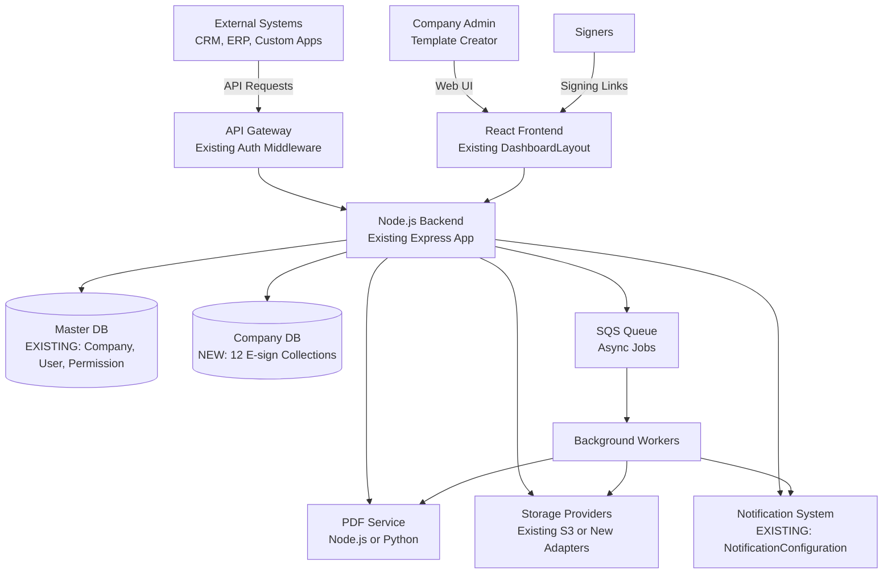
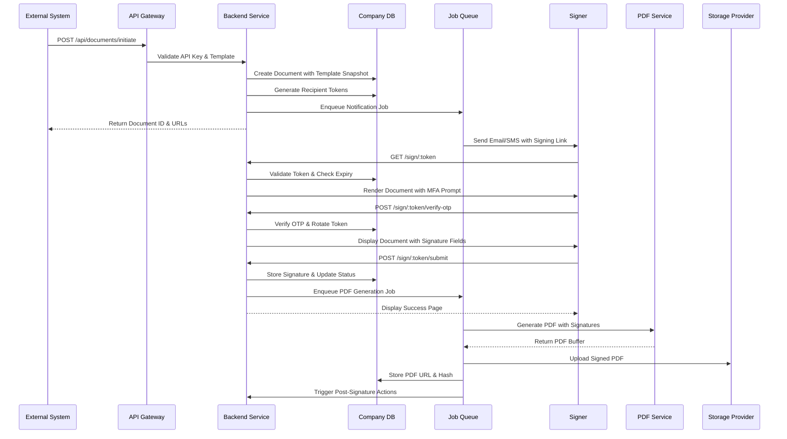

# Design Document: Secure Gateway E-Sign Platform

## Overview

The Secure Gateway E-Sign Platform is an electronic signature module that integrates seamlessly into the existing MERN SaaS application. It enables secure, compliant, and auditable document signing workflows with support for multiple signature types (single, parallel, sequential, broadcast), configurable multi-factor authentication, and comprehensive audit trails.

### Integration with Existing Architecture

This module integrates with the existing multi-tenant MERN SaaS application that already has:

- **Multi-tenant database architecture**: Master DB (companies, users, permissions) + per-company Company DB
- **Model Registry pattern**: Dynamic model loading via `req.getModel()` for company-specific data
- **Authentication system**: Existing auth middleware with role-based access (master_admin, company_super_admin, company_admin)
- **Permission system**: Existing Permission and GroupPermission models with module-based access control
- **Notification system**: Existing Notification and NotificationConfiguration models
- **Audit logging**: Existing GlobalLog model for system-wide audit trails
- **Frontend architecture**: React + TypeScript with TanStack Query, Zustand, Shadcn/ui components
- **API pattern**: Centralized services in `src/api/services.ts` using axios
- **Layout system**: DashboardLayout with collapsible sidebar and role-based navigation

### System Architecture

The e-sign module extends the existing architecture with:

- **Frontend (React):** New pages under `/company/esign/*` for templates, documents, settings, and API keys, plus public signing pages at `/esign/public/*`
- **Backend (Node.js/Express):** New routes under `/api/company/esign/*` and `/api/esign/public/*` using existing middleware
- **Database (MongoDB):** 7 new collections in Company DB (EsignTemplate, EsignDocument, EsignProviderConfig, EsignAPIKey, EsignSigningGroup, EsignBulkJob, EsignAuditLog) plus 5 state management collections (EsignOTP, EsignLock, EsignRateLimit, EsignIdempotency, EsignShortLink) with TTL indexes for automatic expiration
- **PDF Service:** Separate Node.js service using Puppeteer/Playwright or Python microservice using WeasyPrint
- **Storage:** Uses existing S3 config pattern or creates provider adapters for Azure Blob, Google Drive, Dropbox
- **Notifications:** Integrates with existing NotificationConfiguration model
- **Job Queue:** SQS for async job queuing (PDF generation, notifications, webhooks)

### Key Design Decisions

1. **Reuse Existing Infrastructure:** Leverages existing Company and User models, auth middleware, permission system, and notification system
2. **Module-Based Access Control:** E-sign features gated by `requiredModule="esign_documents"` in routes
3. **Company DB Collections:** All e-sign data stored in per-company databases using model registry pattern
4. **Template Snapshotting:** Complete template configuration captured at document creation for consistency
5. **Token-Based Signing Access:** JWT tokens with short expiration for secure, stateless signing page access
6. **Distributed Locking:** MongoDB-based locks prevent concurrent PDF generation using EsignLock collection with TTL indexes
7. **Pluggable Providers:** Adapter pattern for storage and notification services
8. **Audit Integration:** Uses existing GlobalLog or creates EsignAuditLog for e-sign specific events
9. **Asynchronous Processing:** SQS job queues handle PDF generation and notifications without blocking requests


## Architecture

### System Context Diagram



### Integration Points with Existing System

**Reuse Existing (DO NOT CREATE):**
1. **Master DB Models:** Company, User, MasterAdmin, Permission, Plan, GlobalLog, CustomModuleConfig
2. **Company DB Models:** Notification, NotificationConfiguration, GroupPermission, Integration, Dealership
3. **Middleware:** auth.js (JWT validation), tenantContext.js (company DB switching), moduleAccess.js (module gating), notificationMiddleware.js
4. **Services:** activityLogging.service.js, changeDetection.service.js
5. **Frontend:** DashboardLayout, DataTableLayout, API services pattern (src/api/services.ts), TanStack Query, Zustand
6. **Existing S3 Configuration:** Company model already has S3 settings for storage

**Create New (E-sign Specific):**
1. **Company DB Models (7 new collections):** EsignTemplate, EsignDocument, EsignProviderConfig, EsignAPIKey, EsignSigningGroup, EsignBulkJob, EsignAuditLog
2. **Backend Routes:** backend/src/routes/esign.routes.js (main), esignTemplate.routes.js, esignDocument.routes.js, esignPublic.routes.js, esignAPI.routes.js
3. **Backend Controllers:** backend/src/controllers/esign.controller.js, esignTemplate.controller.js, esignDocument.controller.js, esignPublic.controller.js, esignAPI.controller.js
4. **Backend Services:** backend/src/services/esign/pdf.service.js, storage.service.js, notification.service.js, token.service.js, otp.service.js
5. **Backend Middleware:** backend/src/middleware/esignAPIAuth.js, esignRateLimit.js, esignIdempotency.js
6. **Frontend Pages:** src/pages/company/esign/EsignDashboard.tsx, EsignTemplates.tsx, EsignDocuments.tsx, EsignSettings.tsx, EsignAPIKeys.tsx
7. **Frontend Components:** src/components/esign/TemplateEditor.tsx, DocumentViewer.tsx, SignatureCapture.tsx, RecipientManager.tsx, FieldPlacer.tsx
8. **Public Pages:** src/pages/esign/public/SigningPage.tsx, KioskSigningPage.tsx, SigningComplete.tsx, SigningError.tsx

### Component Architecture

The e-sign module is organized into seven core modules:

1. **Settings Module:** Provider configuration, API key management, credential encryption
2. **Templates Module:** PDF upload, field placement, workflow configuration, validation
3. **External API Module:** Authentication, document initiation, status polling, webhooks
4. **E-Sign Public Page Module:** Token validation, MFA, signature capture, field rendering
5. **Document Engine Module:** PDF generation, storage, post-signature processing, certificates
6. **Message Center Module:** Document tracking, search, bulk operations, evidence packages
7. **Audit Log Module:** Immutable logging, export, compliance reporting, retention

### Data Flow: Document Signing Workflow




### Technology Stack

**Frontend (Existing + New):**
- React 18 with TypeScript (EXISTING)
- React Router for navigation (EXISTING)
- TanStack Query (React Query) for server state (EXISTING)
- Zustand for client state (EXISTING)
- Tailwind CSS + Shadcn/ui components (EXISTING)
- React Hook Form for form handling (EXISTING)
- NEW: Signature Canvas library for signature drawing
- NEW: React PDF Viewer for document preview

**Backend (Existing + New):**
- Node.js 20 LTS (EXISTING)
- Express.js for REST API (EXISTING)
- TypeScript for type safety (EXISTING)
- JWT (jsonwebtoken) for tokens (EXISTING)
- bcrypt for password/secret hashing (EXISTING)
- crypto for AES-256 encryption (EXISTING)
- NEW: Bull for job queue (or use existing cron pattern)
- NEW: Puppeteer/Playwright for PDF generation (or separate Python service)

**Database & Cache (Existing + New):**
- MongoDB 7.0 with Mongoose ODM (EXISTING)
- Multi-tenant architecture: Master DB + Company DB (EXISTING)
- Model Registry pattern with `req.getModel()` (EXISTING)
- NEW: MongoDB TTL indexes for state management collections (OTP, locks, rate limits, idempotency, short links) - automatic expiration without external dependencies
- NEW: MongoDB indexes for e-sign collections
- NEW: SQS for async job queuing (PDF generation, notifications, webhooks)

**PDF Service (New):**
- Option 1: Node.js service with Puppeteer/Playwright
- Option 2: Python 3.11 with FastAPI + WeasyPrint
- HTML-to-PDF conversion
- PDF-to-HTML conversion (for template editing)

**External Services (Existing + New):**
- EXISTING: S3 storage configuration in Company settings
- NEW: Optional adapters for Azure Blob, Google Drive, Dropbox
- EXISTING: Notification system via NotificationConfiguration
- NEW: Optional SMS providers (Twilio, SendGrid SMS)
- NEW: MaxMind GeoIP2 for geo location (optional)

**DevOps (Existing):**
- Docker for containerization (EXISTING)
- PM2 for process management (EXISTING)
- Winston for logging (EXISTING)
- Existing monitoring and alerting infrastructure


## Components and Interfaces

### Integration with Existing Middleware

**Existing Middleware (Reuse):**
- `auth.js`: JWT validation, user authentication, role checking
- `tenantContext.js`: Company DB switching based on authenticated user
- `moduleAccess.js`: Module-based access control (checks if user has access to `esign_documents` module)
- `notificationMiddleware.js`: Notification creation and delivery

**New Middleware (Create):**
- `esignAPIAuth.js`: API key validation for external API endpoints
- `esignRateLimit.js`: Rate limiting for API endpoints using MongoDB EsignRateLimit collection
- `esignIdempotency.js`: Idempotency key handling for document creation using MongoDB EsignIdempotency collection

### 1. Settings Module

**Purpose:** Manage provider configurations and API keys with secure credential storage.

**Integration Points:**
- Uses existing Company model for company identification
- Uses existing User model for created_by tracking
- Integrates with existing S3 configuration pattern
- Extends with optional additional storage providers

**Components:**
- `ProviderConfigController`: Handles CRUD operations for storage, email, and SMS providers
- `APIKeyController`: Manages API key generation, listing, and revocation
- `CredentialEncryptionService`: Encrypts/decrypts provider credentials using AES-256
- `ConnectionTestService`: Validates provider configurations by performing test operations

**Key Interfaces:**

```typescript
// Stored in Company DB using req.getModel('EsignProviderConfig')
interface EsignProviderConfig {
  _id: ObjectId;
  company_id: ObjectId; // References Master DB Company
  provider_type: 'storage' | 'email' | 'sms';
  provider: 'aws_s3' | 'azure_blob' | 'google_drive' | 'dropbox' | 'smtp' | 'sendgrid' | 'twilio' | 'sendgrid_sms';
  credentials: EncryptedCredentials;
  settings: Record<string, any>;
  is_active: boolean;
  created_by: ObjectId; // References Master DB User
  created_at: Date;
  updated_at: Date;
}

// Stored in Company DB using req.getModel('EsignAPIKey')
interface EsignAPIKey {
  _id: ObjectId;
  company_id: ObjectId;
  name: string;
  key_prefix: string; // First 8 characters for display
  hashed_secret: string; // bcrypt hash
  scopes: APIKeyScope[];
  is_active: boolean;
  last_used_at?: Date;
  created_by: ObjectId;
  created_at: Date;
  revoked_at?: Date;
  revoked_by?: ObjectId;
}

type APIKeyScope = 'esign:create' | 'esign:status' | 'esign:download' | 'esign:cancel' | 'template:read';

interface ConnectionTestResult {
  success: boolean;
  message: string;
  duration: number;
  error?: string;
}
```

**API Endpoints:**
- `POST /api/company/esign/settings/providers` - Create/update provider configuration (requires `company_super_admin` role)
- `GET /api/company/esign/settings/providers` - List all providers (requires `esign_documents` module access)
- `POST /api/company/esign/settings/providers/:id/test` - Test provider connection
- `POST /api/company/esign/settings/api-keys` - Generate new API key (requires `company_super_admin` role)
- `GET /api/company/esign/settings/api-keys` - List API keys (requires `esign_documents` module access)
- `DELETE /api/company/esign/settings/api-keys/:id` - Revoke API key (requires `company_super_admin` role)

**Middleware Stack:**
```javascript
// Example route configuration in backend/src/routes/esign.routes.js
router.post('/settings/providers', 
  auth,                    // Existing: JWT validation
  tenantContext,           // Existing: Company DB switching
  moduleAccess('esign_documents'),  // Existing: Module access check
  esignController.createProvider
);
```

**Frontend Integration:**
```typescript
// In src/api/services.ts - Add to existing services
export const esignServices = {
  // Settings
  getProviders: (params) => apiClient.get("/api/company/esign/settings/providers", { params }),
  createProvider: (data) => apiClient.post("/api/company/esign/settings/providers", data),
  testProvider: (id) => apiClient.post(`/api/company/esign/settings/providers/${id}/test`),
  
  // API Keys
  getAPIKeys: (params) => apiClient.get("/api/company/esign/settings/api-keys", { params }),
  createAPIKey: (data) => apiClient.post("/api/company/esign/settings/api-keys", data),
  revokeAPIKey: (id) => apiClient.delete(`/api/company/esign/settings/api-keys/${id}`),
};
```

**Route Configuration:**
```typescript
// In src/App.tsx - Add to existing routes
<Route path="/company/esign/settings" element={
  <ProtectedRoute 
    allowedRoles={['company_super_admin']} 
    requiredModule="esign_documents"
  >
    <EsignSettings />
  </ProtectedRoute>
} />

<Route path="/company/esign/api-keys" element={
  <ProtectedRoute 
    allowedRoles={['company_super_admin']} 
    requiredModule="esign_documents"
  >
    <EsignAPIKeys />
  </ProtectedRoute>
} />
```


### 2. Templates Module

**Purpose:** Enable template creation with PDF upload, field placement, and workflow configuration.

**Integration Points:**
- Uses existing User model for created_by tracking
- Uses existing permission system for template creator role
- Follows existing DataTableLayout pattern for template list view

**Components:**
- `TemplateController`: Handles template CRUD operations
- `PDFConverterService`: Interfaces with PDF Service for PDF-to-HTML conversion
- `DelimiterExtractor`: Scans HTML for delimiter patterns and extracts metadata
- `TemplateValidator`: Validates template configuration before activation
- `VisualEditorService`: Manages field placement and HTML manipulation

**Key Interfaces:**

```typescript
// Stored in Company DB using req.getModel('EsignTemplate')
interface EsignTemplate {
  _id: ObjectId;
  company_id: ObjectId;
  name: string;
  description?: string;
  status: 'draft' | 'active' | 'inactive';
  html_content: string;
  signature_type: 'single' | 'multiple' | 'hierarchy' | 'send_to_all';
  delimiters: Delimiter[];
  recipients: RecipientConfig[];
  mfa_config: MFAConfig;
  link_expiry: LinkExpiry;
  preview_mode: boolean;
  notification_config: NotificationConfig;
  routing_rules: RoutingRule[];
  require_scroll_completion: boolean;
  short_link_enabled: boolean;
  is_deleted: boolean;
  version: number;
  created_by: ObjectId;
  created_at: Date;
  updated_at: Date;
}

interface Delimiter {
  key: string;
  type: 'text' | 'email' | 'phone' | 'date' | 'number' | 'signature' | 'initial';
  required: boolean;
  default_value?: string;
  assigned_to?: number; // Recipient signature_order
  position?: { x: number; y: number; page: number };
}

interface RecipientConfig {
  signature_order: number;
  recipient_type: 'individual' | 'group';
  signing_group_id?: ObjectId;
  signature_type: 'remote' | 'in_person';
  label: string;
}

interface MFAConfig {
  enabled: boolean;
  channel: 'email' | 'sms' | 'both';
  otp_expiry_min: number;
}

interface LinkExpiry {
  value: number;
  unit: 'hours' | 'days' | 'weeks';
  grace_period_hours?: number;
}

interface NotificationConfig {
  // Integrates with existing NotificationConfiguration model
  send_on_create: boolean;
  send_on_complete: boolean;
  send_on_reject: boolean;
  send_on_expire: boolean;
  custom_email_template?: string;
  cc_emails?: string[];
}

interface RoutingRule {
  triggered_by: number; // Recipient signature_order
  condition: {
    delimiter_key: string;
    operator: 'equals' | 'not_equals' | 'greater_than' | 'less_than' | 'contains' | 'is_empty';
    value: any;
  };
  action: {
    type: 'activate_signer' | 'skip_signer' | 'add_signer' | 'complete';
    target_order?: number;
    email?: string;
  };
}
```

**API Endpoints:**
- `POST /api/company/esign/templates` - Create template (requires `esign_documents` module)
- `GET /api/company/esign/templates` - List templates (uses DataTableLayout pattern with pagination)
- `GET /api/company/esign/templates/:id` - Get template details
- `PUT /api/company/esign/templates/:id` - Update template
- `DELETE /api/company/esign/templates/:id` - Soft delete template
- `POST /api/company/esign/templates/:id/duplicate` - Duplicate template
- `POST /api/company/esign/templates/:id/activate` - Activate template (requires `company_super_admin` or `company_admin`)
- `POST /api/company/esign/templates/:id/upload-pdf` - Upload PDF for conversion
- `GET /api/company/esign/templates/:id/preview` - Preview template with sample data
- `GET /api/company/esign/templates/:id/schema` - Get payload schema for API integration

**Middleware Stack:**
```javascript
// Example route configuration in backend/src/routes/esignTemplate.routes.js
router.get('/templates', 
  auth,                    // Existing: JWT validation
  tenantContext,           // Existing: Company DB switching
  moduleAccess('esign_documents'),  // Existing: Module access check
  esignTemplateController.listTemplates
);

router.post('/templates/:id/activate',
  auth,
  tenantContext,
  moduleAccess('esign_documents'),
  // Additional role check in controller for company_super_admin or company_admin
  esignTemplateController.activateTemplate
);
```

**Frontend Integration:**
```typescript
// In src/api/services.ts - Add to esignServices object
export const esignServices = {
  // ... settings endpoints above
  
  // Templates
  getTemplates: (params) => apiClient.get("/api/company/esign/templates", { params }),
  getTemplate: (id) => apiClient.get(`/api/company/esign/templates/${id}`),
  createTemplate: (data) => apiClient.post("/api/company/esign/templates", data),
  updateTemplate: (id, data) => apiClient.put(`/api/company/esign/templates/${id}`, data),
  deleteTemplate: (id) => apiClient.delete(`/api/company/esign/templates/${id}`),
  duplicateTemplate: (id) => apiClient.post(`/api/company/esign/templates/${id}/duplicate`),
  activateTemplate: (id) => apiClient.post(`/api/company/esign/templates/${id}/activate`),
  uploadPDF: (id, file) => {
    const formData = new FormData();
    formData.append('pdf', file);
    return apiClient.post(`/api/company/esign/templates/${id}/upload-pdf`, formData, {
      headers: { 'Content-Type': 'multipart/form-data' }
    });
  },
  previewTemplate: (id, data) => apiClient.get(`/api/company/esign/templates/${id}/preview`, { params: data }),
  getTemplateSchema: (id) => apiClient.get(`/api/company/esign/templates/${id}/schema`),
};
```

**Route Configuration:**
```typescript
// In src/App.tsx - Add to existing routes
<Route path="/company/esign/templates" element={
  <ProtectedRoute 
    allowedRoles={['company_super_admin', 'company_admin']} 
    requiredModule="esign_documents"
  >
    <EsignTemplates />
  </ProtectedRoute>
} />

<Route path="/company/esign/templates/:id" element={
  <ProtectedRoute 
    allowedRoles={['company_super_admin', 'company_admin']} 
    requiredModule="esign_documents"
  >
    <TemplateEditor />
  </ProtectedRoute>
} />
```

**DataTableLayout Integration:**
```typescript
// In src/pages/company/esign/EsignTemplates.tsx
import { DataTableLayout } from '@/components/layout/DataTableLayout';
import { esignServices } from '@/api/services';

export const EsignTemplates = () => {
  const columns = [
    { accessorKey: 'name', header: 'Template Name' },
    { accessorKey: 'status', header: 'Status' },
    { accessorKey: 'signature_type', header: 'Signature Type' },
    { accessorKey: 'created_at', header: 'Created' },
    // ... more columns
  ];

  return (
    <DataTableLayout
      title="E-Sign Templates"
      columns={columns}
      fetchData={esignServices.getTemplates}
      createRoute="/company/esign/templates/new"
      // ... other props
    />
  );
};
```

**Navigation Menu:**
```typescript
// In src/components/layout/DashboardLayout.tsx - Add to navigation items array
{
  icon: FileSignature,  // from lucide-react
  label: "E-Sign",
  module: "esign_documents",  // Module-based access control
  children: [
    { 
      icon: Home, 
      label: "Dashboard", 
      path: "/company/esign/dashboard",
      module: "esign_documents"
    },
    { 
      icon: FileText, 
      label: "Templates", 
      path: "/company/esign/templates",
      module: "esign_documents"
    },
    { 
      icon: Mail, 
      label: "Documents", 
      path: "/company/esign/documents",
      module: "esign_documents"
    },
    { 
      icon: Settings, 
      label: "Settings", 
      path: "/company/esign/settings",
      module: "esign_documents",
      allowedRoles: ['company_super_admin']  // Admin only
    },
    { 
      icon: Key, 
      label: "API Keys", 
      path: "/company/esign/api-keys",
      module: "esign_documents",
      allowedRoles: ['company_super_admin']  // Admin only
    },
  ]
}
```


### 3. External API Module

**Purpose:** Provide secure API for external systems to initiate and manage e-sign workflows.

**Integration Points:**
- Uses custom `esignAPIAuth.js` middleware for API key validation
- Uses existing Company model for company identification
- Uses MongoDB EsignIdempotency and EsignRateLimit collections for idempotency keys and rate limiting
- Integrates with existing GlobalLog for API audit trails

**Components:**
- `APIAuthMiddleware`: Validates API keys and enforces scope-based permissions
- `DocumentInitiationController`: Handles document creation via API
- `IdempotencyService`: Prevents duplicate document creation using MongoDB EsignIdempotency collection
- `RateLimitMiddleware`: Enforces rate limits per API key using MongoDB EsignRateLimit collection
- `WebhookService`: Sends signed webhooks to external systems

**Key Interfaces:**

```typescript
interface DocumentInitiationRequest {
  template_id: string;
  payload: Record<string, any>;
  recipients: RecipientData[];
  idempotency_key?: string;
  callback_url?: string;
}

interface RecipientData {
  email: string;
  phone?: string;
  name: string;
  signature_order?: number;
}

interface DocumentInitiationResponse {
  document_id: string;
  status: string;
  recipients: {
    email: string;
    signing_url: string;
    short_url?: string;
  }[];
  preview_url?: string;
}

interface DocumentStatusResponse {
  document_id: string;
  status: DocumentStatus;
  recipients: RecipientStatus[];
  events: DocumentEvent[];
  pdf_url?: string;
  certificate_url?: string;
}

interface WebhookPayload {
  event: 'document.completed' | 'document.rejected' | 'document.expired';
  document_id: string;
  timestamp: string;
  data: Record<string, any>;
}
```

**API Endpoints (External - No Auth Middleware):**
- `POST /api/v1/esign/documents/initiate` - Initiate document signing (scope: esign:create)
- `GET /api/v1/esign/documents/:id/status` - Get document status (scope: esign:status)
- `GET /api/v1/esign/documents/:id/download` - Download signed PDF (scope: esign:download)
- `POST /api/v1/esign/documents/:id/cancel` - Cancel document (scope: esign:cancel)
- `GET /api/v1/esign/templates/:id/schema` - Get template schema (scope: template:read)
- `POST /api/v1/esign/bulk/initiate` - Bulk document initiation from CSV (scope: esign:create)

**Authentication:**
- Header: `x-api-key: <api_key>`
- Optional: `x-idempotency-key: <unique_key>`
- Rate Limit: 100 requests/minute per API key (stored in MongoDB EsignRateLimit collection)

**Backend Implementation:**
```javascript
// backend/src/middleware/esignAPIAuth.js
const EsignAPIKey = require('../models/EsignAPIKey');
const bcrypt = require('bcrypt');

const esignAPIAuth = async (req, res, next) => {
  try {
    const apiKey = req.headers['x-api-key'];
    if (!apiKey) {
      return res.status(401).json({ error: 'API key required' });
    }
    
    // Extract key prefix (first 8 characters)
    const keyPrefix = apiKey.substring(0, 8);
    
    // Find API key across all company databases
    // Note: This requires a strategy to identify which company DB to check
    // Option 1: Store API keys in Master DB with company_id reference
    // Option 2: Use key prefix format that includes company identifier
    // Option 3: Check all company DBs (not scalable)
    
    // Recommended: Store in Master DB or use company-specific key format
    const apiKeyDoc = await EsignAPIKey.findOne({ 
      key_prefix: keyPrefix, 
      is_active: true 
    });
    
    if (!apiKeyDoc || !bcrypt.compareSync(apiKey, apiKeyDoc.hashed_secret)) {
      return res.status(401).json({ error: 'Invalid API key' });
    }
    
    // Attach company and API key to request for downstream use
    req.company_id = apiKeyDoc.company_id;
    req.api_key = apiKeyDoc;
    
    // Update last_used_at timestamp
    apiKeyDoc.last_used_at = new Date();
    await apiKeyDoc.save();
    
    next();
  } catch (error) {
    console.error('API auth error:', error);
    return res.status(500).json({ error: 'Authentication failed' });
  }
};

module.exports = esignAPIAuth;
```

**Rate Limiting Middleware:**
```javascript
// backend/src/middleware/esignRateLimit.js
// Uses MongoDB for rate limiting with TTL indexes for automatic expiration
const esignRateLimit = async (req, res, next) => {
  try {
    const EsignRateLimit = req.getModel('EsignRateLimit');
    const keyPrefix = req.api_key.key_prefix;
    const minute = Math.floor(Date.now() / 60000);
    const rateLimitKey = `${keyPrefix}:${minute}`;
    
    // Find or create rate limit record in MongoDB
    const rateLimit = await EsignRateLimit.findOneAndUpdate(
      { key: rateLimitKey },
      { 
        $inc: { count: 1 },
        $setOnInsert: { 
          key: rateLimitKey,
          expires_at: new Date(Date.now() + 60000) // 1 minute TTL - MongoDB will auto-delete
        }
      },
      { upsert: true, new: true }
    );
    
    if (rateLimit.count > 100) {
      return res.status(429).json({ 
        error: 'Rate limit exceeded',
        retryAfter: 60 - (Date.now() / 1000 % 60)
      });
    }
    
    next();
  } catch (error) {
    console.error('Rate limit error:', error);
    next(); // Fail open on database errors
  }
};

module.exports = esignRateLimit;
```


### 4. E-Sign Public Page Module

**Purpose:** Provide secure, user-friendly signing interface for signers.

**Components:**
- `SigningPageController`: Handles token validation and document rendering
- `MFAService`: Manages OTP generation, verification, and lockout
- `SignatureService`: Processes signature capture and submission
- `TokenService`: Generates, validates, and rotates JWT tokens
- `GeoLocationService`: Captures IP-based geo location

**Key Interfaces:**

```typescript
interface SigningSession {
  token: string;
  documentId: ObjectId;
  recipientId: ObjectId;
  expiresAt: Date;
  mfaVerified: boolean;
  scrollCompleted: boolean;
}

interface OTPRecord {
  recipientId: ObjectId;
  hashedOTP: string;
  expiresAt: Date;
  attempts: number;
  lockedUntil?: Date;
}

interface SignatureSubmission {
  signatureImage: string; // base64 PNG
  signatureType: 'draw' | 'type' | 'upload';
  intentConfirmed: boolean;
  ipAddress: string;
  userAgent: string;
  geoLocation?: GeoLocation;
  timestamp: Date;
}

interface GeoLocation {
  country: string;
  region: string;
  city: string;
  latitude: number;
  longitude: number;
}

interface DelegationRequest {
  delegateEmail: string;
  delegateName: string;
  reason?: string;
}
```

**Public Endpoints:**
- `GET /sign/:token` - Access signing page
- `POST /sign/:token/send-otp` - Request OTP
- `POST /sign/:token/verify-otp` - Verify OTP
- `POST /sign/:token/submit` - Submit signature
- `POST /sign/:token/decline` - Decline signature
- `POST /sign/:token/delegate` - Delegate signing
- `GET /sign/:token/scroll-complete` - Mark scroll completion
- `GET /s/:shortCode` - Short link redirect

**Kiosk Endpoints:**
- `GET /kiosk/:token` - Access kiosk signing page
- `POST /kiosk/:token/authenticate-host` - Host authentication
- `POST /kiosk/:token/capture-photo` - Capture signer photo
- `POST /kiosk/:token/submit` - Submit in-person signature


### 5. Document Engine Module

**Purpose:** Generate, store, and manage signed PDFs with integrity verification.

**Components:**
- `PDFGenerationService`: Orchestrates PDF generation workflow
- `SignatureInjector`: Injects signature images into HTML at delimiter positions
- `AuditFooterGenerator`: Appends audit information to PDF
- `StorageAdapter`: Abstract interface for storage providers
- `DistributedLockService`: Manages MongoDB-based locks using EsignLock collection
- `CertificateGenerator`: Creates certificate of completion PDFs
- `EvidencePackageService`: Generates ZIP files with all signing materials

**Key Interfaces:**

```typescript
interface PDFGenerationJob {
  documentId: ObjectId;
  htmlContent: string;
  signatures: Map<string, string>; // delimiter -> base64 image
  auditData: AuditFooter;
  lockKey: string;
}

interface AuditFooter {
  documentId: string;
  completedAt: Date;
  signers: {
    name: string;
    email: string;
    signedAt: Date;
    ipAddress: string;
    geoLocation?: string;
  }[];
}

interface StorageResult {
  url: string;
  provider: string;
  path: string;
  hash: string;
  uploadedAt: Date;
}

interface CertificateData {
  documentId: string;
  templateName: string;
  completedAt: Date;
  signers: SignerInfo[];
  pdfHash: string;
  verificationUrl: string;
}

interface EvidencePackage {
  signedPdf: Buffer;
  certificate: Buffer;
  auditTrail: string; // CSV format
  verificationFile: string; // JSON with hash
}
```

**Internal Services:**
- `PDFGenerationService.generate(documentId)` - Generate signed PDF
- `StorageAdapter.upload(buffer, path)` - Upload to storage
- `StorageAdapter.download(path)` - Download from storage
- `StorageAdapter.generatePresignedUrl(path, expiry)` - Generate download URL
- `CertificateGenerator.generate(documentId)` - Generate certificate
- `EvidencePackageService.create(documentId)` - Create evidence package


### 6. Message Center Module

**Purpose:** Provide document tracking, search, and bulk operations for administrators.

**Components:**
- `MessageCenterController`: Handles document listing and filtering
- `DocumentSearchService`: Implements search and filter logic
- `BulkOperationService`: Processes bulk actions on multiple documents
- `DocumentDetailService`: Provides detailed document information
- `TimelineService`: Generates document event timelines

**Key Interfaces:**

```typescript
interface DocumentListQuery {
  status?: DocumentStatus[];
  templateId?: string;
  recipientEmail?: string;
  dateFrom?: Date;
  dateTo?: Date;
  page: number;
  limit: number;
  sortBy: 'createdAt' | 'updatedAt' | 'expiresAt';
  sortOrder: 'asc' | 'desc';
}

interface DocumentListResponse {
  documents: DocumentSummary[];
  total: number;
  page: number;
  pages: number;
}

interface DocumentSummary {
  _id: string;
  templateName: string;
  status: DocumentStatus;
  recipients: RecipientSummary[];
  createdAt: Date;
  expiresAt: Date;
  completedAt?: Date;
}

interface BulkOperation {
  action: 'cancel' | 'download' | 'resend' | 'delete';
  documentIds: string[];
}

interface BulkOperationResult {
  total: number;
  succeeded: number;
  failed: number;
  errors: { documentId: string; error: string }[];
}

interface DocumentTimeline {
  events: TimelineEvent[];
}

interface TimelineEvent {
  type: string;
  timestamp: Date;
  actor: string;
  metadata: Record<string, any>;
  icon: string;
  color: string;
}
```

**API Endpoints:**
- `GET /api/company/esign/documents` - List documents with filters (uses DataTableLayout pattern)
- `GET /api/company/esign/documents/:id` - Get document details
- `POST /api/company/esign/documents/:id/resend` - Resend signing link
- `POST /api/company/esign/documents/:id/remind` - Send reminder
- `POST /api/company/esign/documents/:id/cancel` - Cancel document
- `GET /api/company/esign/documents/:id/download` - Download signed PDF
- `GET /api/company/esign/documents/:id/verify` - Verify PDF integrity
- `GET /api/company/esign/documents/:id/timeline` - Get document timeline
- `GET /api/company/esign/documents/:id/evidence-package` - Download evidence package
- `POST /api/company/esign/documents/bulk` - Perform bulk operation

**Middleware Stack:**
```javascript
// Example route configuration in backend/src/routes/esignDocument.routes.js
router.get('/documents', 
  auth,                    // Existing: JWT validation
  tenantContext,           // Existing: Company DB switching
  moduleAccess('esign_documents'),  // Existing: Module access check
  esignDocumentController.listDocuments
);

router.post('/documents/:id/cancel',
  auth,
  tenantContext,
  moduleAccess('esign_documents'),
  esignDocumentController.cancelDocument
);
```

**Frontend Integration:**
```typescript
// In src/api/services.ts - Add to esignServices object
export const esignServices = {
  // ... previous endpoints
  
  // Documents
  getDocuments: (params) => apiClient.get("/api/company/esign/documents", { params }),
  getDocument: (id) => apiClient.get(`/api/company/esign/documents/${id}`),
  resendDocument: (id) => apiClient.post(`/api/company/esign/documents/${id}/resend`),
  remindDocument: (id) => apiClient.post(`/api/company/esign/documents/${id}/remind`),
  cancelDocument: (id) => apiClient.post(`/api/company/esign/documents/${id}/cancel`),
  downloadDocument: (id) => apiClient.get(`/api/company/esign/documents/${id}/download`, { responseType: 'blob' }),
  verifyDocument: (id) => apiClient.get(`/api/company/esign/documents/${id}/verify`),
  getDocumentTimeline: (id) => apiClient.get(`/api/company/esign/documents/${id}/timeline`),
  downloadEvidencePackage: (id) => apiClient.get(`/api/company/esign/documents/${id}/evidence-package`, { responseType: 'blob' }),
  bulkOperation: (data) => apiClient.post("/api/company/esign/documents/bulk", data),
};
```

**Route Configuration:**
```typescript
// In src/App.tsx - Add to existing routes
<Route path="/company/esign/documents" element={
  <ProtectedRoute 
    allowedRoles={['company_super_admin', 'company_admin']} 
    requiredModule="esign_documents"
  >
    <EsignDocuments />
  </ProtectedRoute>
} />

<Route path="/company/esign/documents/:id" element={
  <ProtectedRoute 
    allowedRoles={['company_super_admin', 'company_admin']} 
    requiredModule="esign_documents"
  >
    <DocumentDetail />
  </ProtectedRoute>
} />
```

**DataTableLayout Integration:**
```typescript
// In src/pages/company/esign/EsignDocuments.tsx
import { DataTableLayout } from '@/components/layout/DataTableLayout';
import { esignServices } from '@/api/services';

export const EsignDocuments = () => {
  const columns = [
    { accessorKey: 'template_name', header: 'Template' },
    { accessorKey: 'status', header: 'Status' },
    { accessorKey: 'recipients', header: 'Recipients', cell: (row) => row.recipients.length },
    { accessorKey: 'created_at', header: 'Created' },
    { accessorKey: 'expires_at', header: 'Expires' },
    // ... more columns
  ];

  return (
    <DataTableLayout
      title="E-Sign Documents"
      columns={columns}
      fetchData={esignServices.getDocuments}
      // ... other props
    />
  );
};
```


### 7. Audit Log Module

**Purpose:** Provide immutable, comprehensive audit trail for compliance and security.

**Components:**
- `AuditLogger`: Centralized service for creating audit log entries
- `AuditLogController`: Handles audit log queries and exports
- `AuditExportService`: Generates CSV and JSON exports
- `RetentionPolicyService`: Implements data retention and archival

**Key Interfaces:**

```typescript
interface AuditLogEntry {
  _id: ObjectId;
  companyId: ObjectId;
  eventType: AuditEventType;
  actor: {
    type: 'user' | 'system' | 'api' | 'signer';
    id?: string;
    email?: string;
    apiKeyPrefix?: string;
  };
  resource: {
    type: 'document' | 'template' | 'provider' | 'api_key' | 'recipient';
    id: string;
  };
  action: string;
  metadata: Record<string, any>;
  ipAddress: string;
  userAgent: string;
  geoLocation?: GeoLocation;
  timestamp: Date;
}

type AuditEventType = 
  | 'auth.login' | 'auth.logout' | 'auth.failed'
  | 'provider.created' | 'provider.updated' | 'provider.tested'
  | 'api_key.generated' | 'api_key.revoked'
  | 'template.created' | 'template.updated' | 'template.deleted' | 'template.activated'
  | 'document.created' | 'document.distributed' | 'document.opened' | 'document.signed' 
  | 'document.completed' | 'document.rejected' | 'document.cancelled' | 'document.expired'
  | 'token.generated' | 'token.validated' | 'token.rotated' | 'token.expired'
  | 'otp.generated' | 'otp.verified' | 'otp.failed' | 'otp.locked'
  | 'signature.submitted' | 'signature.rejected'
  | 'pdf.generated' | 'pdf.stored' | 'pdf.downloaded' | 'pdf.verified'
  | 'notification.sent' | 'notification.failed'
  | 'webhook.sent' | 'webhook.failed';

interface AuditLogQuery {
  eventTypes?: AuditEventType[];
  resourceType?: string;
  resourceId?: string;
  actorEmail?: string;
  dateFrom?: Date;
  dateTo?: Date;
  page: number;
  limit: number;
}

interface AuditExportRequest {
  format: 'csv' | 'json';
  query: AuditLogQuery;
}
```

**API Endpoints:**
- `GET /api/company/esign/audit-logs` - Query audit logs (requires `esign_documents` module)
- `POST /api/company/esign/audit-logs/export` - Export audit logs (requires `company_super_admin` role)
- `GET /api/company/esign/audit-logs/stats` - Get audit statistics

**Integration with Existing GlobalLog:**

The system can either create a dedicated EsignAuditLog collection or extend the existing GlobalLog model:

**Option 1: Use Existing GlobalLog (Recommended)**
```javascript
// In backend/src/services/esign/audit.service.js
const GlobalLog = require('../../models/GlobalLog');

const logEsignEvent = async (eventData) => {
  await GlobalLog.create({
    company_id: eventData.company_id,
    user_id: eventData.user_id,
    action: eventData.action,
    module: 'esign',  // Module identifier
    details: {
      event_type: eventData.event_type,
      resource: eventData.resource,
      metadata: eventData.metadata,
      geo_location: eventData.geo_location
    },
    ip_address: eventData.ip_address,
    user_agent: eventData.user_agent,
    created_at: new Date()
  });
};

module.exports = { logEsignEvent };
```

**Option 2: Create Dedicated EsignAuditLog**
```javascript
// backend/src/models/EsignAuditLog.js
const mongoose = require('mongoose');

const esignAuditLogSchema = new mongoose.Schema({
  company_id: { type: mongoose.Schema.Types.ObjectId, required: true, ref: 'Company' },
  event_type: { type: String, required: true },
  actor: {
    type: { type: String, enum: ['user', 'system', 'api', 'signer'], required: true },
    id: String,
    email: String,
    api_key_prefix: String
  },
  resource: {
    type: { type: String, required: true },
    id: { type: String, required: true }
  },
  action: { type: String, required: true },
  metadata: { type: mongoose.Schema.Types.Mixed },
  ip_address: String,
  user_agent: String,
  geo_location: {
    country: String,
    region: String,
    city: String,
    latitude: Number,
    longitude: Number
  },
  timestamp: { type: Date, default: Date.now },
  hash_chain: String  // For tamper detection
}, {
  timestamps: false,
  collection: 'esign_audit_logs'
});

// Indexes
esignAuditLogSchema.index({ company_id: 1, timestamp: -1 });
esignAuditLogSchema.index({ company_id: 1, event_type: 1, timestamp: -1 });
esignAuditLogSchema.index({ 'resource.type': 1, 'resource.id': 1, timestamp: -1 });
esignAuditLogSchema.index({ 'actor.email': 1, timestamp: -1 });

module.exports = esignAuditLogSchema;
```


## Data Models

### Existing Models (DO NOT CREATE - REUSE)

**Master Database (Existing - Reference Only):**

These models already exist in the Master DB and should be referenced, not recreated:

```typescript
// EXISTING - backend/src/models/Company.js
interface Company {
  _id: ObjectId;
  name: string;
  domain: string;
  db_name: string; // company-specific database name
  timezone: string;
  timezone_display: 'UTC' | 'company_timezone' | 'browser_timezone';
  s3_config?: {  // EXISTING S3 configuration - reuse for e-sign storage
    bucket: string;
    region: string;
    access_key_id: string;
    secret_access_key: string;
  };
  is_active: boolean;
  created_at: Date;
  updated_at: Date;
}

// EXISTING - backend/src/models/User.js
interface User {
  _id: ObjectId;
  company_id: ObjectId;
  email: string;
  password_hash: string;
  role: 'master_admin' | 'company_super_admin' | 'company_admin';
  is_active: boolean;
  last_login_at?: Date;
  created_at: Date;
  updated_at: Date;
}

// EXISTING - backend/src/models/Permission.js
interface Permission {
  _id: ObjectId;
  name: string;
  module: string;
  description: string;
  is_active: boolean;
  created_at: Date;
  updated_at: Date;
}

// EXISTING - backend/src/models/GlobalLog.js
interface GlobalLog {
  _id: ObjectId;
  company_id: ObjectId;
  user_id?: ObjectId;
  action: string;
  module: string;  // Use 'esign' for e-sign events
  details: Record<string, any>;
  ip_address: string;
  user_agent: string;
  created_at: Date;
}

// EXISTING - backend/src/models/CustomModuleConfig.js
// Add 'esign_documents' module to this for module access control
interface CustomModuleConfig {
  _id: ObjectId;
  company_id: ObjectId;
  module_name: string;  // Add 'esign_documents'
  is_enabled: boolean;
  config: Record<string, any>;
  created_at: Date;
  updated_at: Date;
}
```

**Company Database (Existing - Reference Only):**

These models already exist in each Company DB and should be referenced:

```typescript
// EXISTING - backend/src/models/Notification.js
interface Notification {
  _id: ObjectId;
  company_id: ObjectId;
  user_id: ObjectId;
  title: string;
  message: string;
  type: string;
  is_read: boolean;
  created_at: Date;
}

// EXISTING - backend/src/models/NotificationConfiguration.js
// Integrate e-sign notifications with this existing system
interface NotificationConfiguration {
  _id: ObjectId;
  company_id: ObjectId;
  event_type: string;  // Add e-sign event types: 'esign.document.created', 'esign.document.signed', etc.
  notification_type: 'email' | 'sms' | 'in_app';
  recipients: string[];
  template: string;
  is_active: boolean;
  created_at: Date;
  updated_at: Date;
}

// EXISTING - backend/src/models/GroupPermission.js
interface GroupPermission {
  _id: ObjectId;
  company_id: ObjectId;
  name: string;
  permissions: ObjectId[]; // References Permission in Master DB
  module_access: string[];  // Add 'esign_documents' for e-sign access
  is_active: boolean;
  created_at: Date;
  updated_at: Date;
}

// EXISTING - backend/src/models/Dealership.js (if applicable)
interface Dealership {
  _id: ObjectId;
  company_id: ObjectId;
  name: string;
  // ... other fields
}
```

### New Models (CREATE - E-sign Specific)

**Company Database (company_{id}_db) - New Collections:**

Create these 7 new Mongoose models in the Company DB. Access via Model Registry pattern:

**EsignTemplate Collection:**
```javascript
// backend/src/models/EsignTemplate.js
const mongoose = require('mongoose');

const esignTemplateSchema = new mongoose.Schema({
  company_id: { type: mongoose.Schema.Types.ObjectId, required: true, ref: 'Company' },
  name: { type: String, required: true },
  description: String,
  status: { type: String, enum: ['draft', 'active', 'inactive'], default: 'draft' },
  html_content: { type: String, required: true },
  signature_type: { 
    type: String, 
    enum: ['single', 'multiple', 'hierarchy', 'send_to_all'], 
    required: true 
  },
  delimiters: [{
    key: { type: String, required: true },
    type: { 
      type: String, 
      enum: ['text', 'email', 'phone', 'date', 'number', 'signature', 'initial'],
      required: true 
    },
    required: { type: Boolean, default: false },
    default_value: String,
    assigned_to: Number,  // Recipient signature_order
    position: {
      x: Number,
      y: Number,
      page: Number
    }
  }],
  recipients: [{
    signature_order: { type: Number, required: true },
    recipient_type: { type: String, enum: ['individual', 'group'], required: true },
    signing_group_id: { type: mongoose.Schema.Types.ObjectId, ref: 'EsignSigningGroup' },
    signature_type: { type: String, enum: ['remote', 'in_person'], required: true },
    label: { type: String, required: true }
  }],
  mfa_config: {
    enabled: { type: Boolean, default: false },
    channel: { type: String, enum: ['email', 'sms', 'both'], default: 'email' },
    otp_expiry_min: { type: Number, default: 10 }
  },
  link_expiry: {
    value: { type: Number, required: true },
    unit: { type: String, enum: ['hours', 'days', 'weeks'], required: true },
    grace_period_hours: Number
  },
  preview_mode: { type: Boolean, default: false },
  notification_config: {
    send_on_create: { type: Boolean, default: true },
    send_on_complete: { type: Boolean, default: true },
    send_on_reject: { type: Boolean, default: true },
    send_on_expire: { type: Boolean, default: true },
    custom_email_template: String,
    cc_emails: [String]
  },
  routing_rules: [{
    triggered_by: Number,
    condition: {
      delimiter_key: String,
      operator: { 
        type: String, 
        enum: ['equals', 'not_equals', 'greater_than', 'less_than', 'contains', 'is_empty'] 
      },
      value: mongoose.Schema.Types.Mixed
    },
    action: {
      type: { type: String, enum: ['activate_signer', 'skip_signer', 'add_signer', 'complete'] },
      target_order: Number,
      email: String
    }
  }],
  require_scroll_completion: { type: Boolean, default: false },
  short_link_enabled: { type: Boolean, default: false },
  is_deleted: { type: Boolean, default: false },
  version: { type: Number, default: 1 },
  created_by: { type: mongoose.Schema.Types.ObjectId, required: true, ref: 'User' },
}, {
  timestamps: true,
  collection: 'esign_templates'
});

// Indexes
esignTemplateSchema.index({ company_id: 1, status: 1 });
esignTemplateSchema.index({ company_id: 1, is_deleted: 1 });
esignTemplateSchema.index({ company_id: 1, createdAt: -1 });

module.exports = esignTemplateSchema;
```

**EsignDocument Collection:**
```javascript
// backend/src/models/EsignDocument.js
const mongoose = require('mongoose');

const recipientSchema = new mongoose.Schema({
  email: { type: String, required: true },
  phone: String,
  name: { type: String, required: true },
  signature_order: { type: Number, required: true },
  status: { 
    type: String, 
    enum: ['pending', 'active', 'opened', 'signed', 'rejected', 'skipped', 'expired'],
    default: 'pending'
  },
  token: String,
  token_expires_at: Date,
  signature_image: String,
  signature_type: { type: String, enum: ['draw', 'type', 'upload'] },
  signed_at: Date,
  ip_address: String,
  user_agent: String,
  geo_location: {
    country: String,
    region: String,
    city: String,
    latitude: Number,
    longitude: Number
  },
  intent_confirmation: String,
  delegated_from: String,
  delegation_reason: String,
  group_id: { type: mongoose.Schema.Types.ObjectId, ref: 'EsignSigningGroup' },
  group_member_email: String,
  kiosk_host_id: { type: mongoose.Schema.Types.ObjectId, ref: 'User' },
  kiosk_location: String,
  signer_photo: String,
  scroll_completed_at: Date
}, { _id: true });

const esignDocumentSchema = new mongoose.Schema({
  company_id: { type: mongoose.Schema.Types.ObjectId, required: true, ref: 'Company' },
  template_id: { type: mongoose.Schema.Types.ObjectId, required: true, ref: 'EsignTemplate' },
  template_snapshot: { type: mongoose.Schema.Types.Mixed, required: true },  // Complete template at creation
  status: { 
    type: String, 
    enum: ['new', 'draft_preview', 'distributed', 'opened', 'partially_signed', 'signed', 'completed', 'rejected', 'cancelled', 'expired', 'error'],
    default: 'new'
  },
  payload: { type: mongoose.Schema.Types.Mixed, required: true },  // Delimiter values
  recipients: [recipientSchema],
  pdf_url: String,
  pdf_hash: String,
  certificate_url: String,
  expires_at: { type: Date, required: true },
  completed_at: Date,
  error_reason: String,
  callback_url: String,
  callback_status: { type: String, enum: ['pending', 'success', 'failed'] },
  idempotency_key: { type: String, sparse: true, unique: true },
  bulk_job_id: { type: mongoose.Schema.Types.ObjectId, ref: 'EsignBulkJob' },
  created_by: {
    type: { type: String, enum: ['api', 'user'], required: true },
    id: { type: String, required: true }
  },
}, {
  timestamps: true,
  collection: 'esign_documents'
});

// Indexes
esignDocumentSchema.index({ company_id: 1, status: 1 });
esignDocumentSchema.index({ company_id: 1, template_id: 1 });
esignDocumentSchema.index({ company_id: 1, createdAt: -1 });
esignDocumentSchema.index({ company_id: 1, expires_at: 1 });
esignDocumentSchema.index({ 'recipients.email': 1 });
esignDocumentSchema.index({ idempotency_key: 1 }, { unique: true, sparse: true });

module.exports = esignDocumentSchema;
```

**EsignProviderConfig Collection:**
```javascript
// backend/src/models/EsignProviderConfig.js
const mongoose = require('mongoose');

const esignProviderConfigSchema = new mongoose.Schema({
  company_id: { type: mongoose.Schema.Types.ObjectId, required: true, ref: 'Company' },
  provider_type: { type: String, enum: ['storage', 'email', 'sms'], required: true },
  provider: { type: String, required: true },
  credentials: {
    encrypted: { type: String, required: true },
    iv: { type: String, required: true },
    algorithm: { type: String, default: 'aes-256-cbc' }
  },
  settings: { type: mongoose.Schema.Types.Mixed },
  is_active: { type: Boolean, default: false },
  last_tested_at: Date,
  test_result: {
    success: Boolean,
    message: String,
    duration: Number,
    error: String
  },
  created_by: { type: mongoose.Schema.Types.ObjectId, required: true, ref: 'User' },
}, {
  timestamps: true,
  collection: 'esign_provider_configs'
});

// Indexes
esignProviderConfigSchema.index({ company_id: 1, provider_type: 1, is_active: 1 });

module.exports = esignProviderConfigSchema;
```

**EsignAPIKey Collection:**
```javascript
// backend/src/models/EsignAPIKey.js
const mongoose = require('mongoose');

const esignAPIKeySchema = new mongoose.Schema({
  company_id: { type: mongoose.Schema.Types.ObjectId, required: true, ref: 'Company' },
  name: { type: String, required: true },
  key_prefix: { type: String, required: true },  // First 8 characters
  hashed_secret: { type: String, required: true },  // bcrypt hash
  scopes: [{ 
    type: String, 
    enum: ['esign:create', 'esign:status', 'esign:download', 'esign:cancel', 'template:read']
  }],
  is_active: { type: Boolean, default: true },
  last_used_at: Date,
  created_by: { type: mongoose.Schema.Types.ObjectId, required: true, ref: 'User' },
  revoked_at: Date,
  revoked_by: { type: mongoose.Schema.Types.ObjectId, ref: 'User' }
}, {
  timestamps: true,
  collection: 'esign_api_keys'
});

// Indexes
esignAPIKeySchema.index({ company_id: 1, key_prefix: 1 });
esignAPIKeySchema.index({ company_id: 1, is_active: 1 });

module.exports = esignAPIKeySchema;
```

**EsignSigningGroup Collection:**
```javascript
// backend/src/models/EsignSigningGroup.js
const mongoose = require('mongoose');

const esignSigningGroupSchema = new mongoose.Schema({
  company_id: { type: mongoose.Schema.Types.ObjectId, required: true, ref: 'Company' },
  name: { type: String, required: true },
  members: [{
    email: { type: String, required: true },
    name: { type: String, required: true }
  }],
  is_active: { type: Boolean, default: true },
  created_by: { type: mongoose.Schema.Types.ObjectId, required: true, ref: 'User' },
}, {
  timestamps: true,
  collection: 'esign_signing_groups'
});

// Indexes
esignSigningGroupSchema.index({ company_id: 1, is_active: 1 });

module.exports = esignSigningGroupSchema;
```

**EsignBulkJob Collection:**
```javascript
// backend/src/models/EsignBulkJob.js
const mongoose = require('mongoose');

const esignBulkJobSchema = new mongoose.Schema({
  company_id: { type: mongoose.Schema.Types.ObjectId, required: true, ref: 'Company' },
  template_id: { type: mongoose.Schema.Types.ObjectId, required: true, ref: 'EsignTemplate' },
  status: { 
    type: String, 
    enum: ['queued', 'processing', 'completed', 'failed'],
    default: 'queued'
  },
  csv_data: {
    headers: [String],
    rows: [[mongoose.Schema.Types.Mixed]]
  },
  column_mapping: { type: mongoose.Schema.Types.Mixed },  // CSV column -> delimiter key
  progress: {
    total: { type: Number, default: 0 },
    processed: { type: Number, default: 0 },
    succeeded: { type: Number, default: 0 },
    failed: { type: Number, default: 0 }
  },
  errors: [{
    row: Number,
    error: String
  }],
  document_ids: [{ type: mongoose.Schema.Types.ObjectId, ref: 'EsignDocument' }],
  webhook_url: String,
  created_by: { type: mongoose.Schema.Types.ObjectId, required: true, ref: 'User' },
  completed_at: Date
}, {
  timestamps: true,
  collection: 'esign_bulk_jobs'
});

// Indexes
esignBulkJobSchema.index({ company_id: 1, status: 1 });
esignBulkJobSchema.index({ company_id: 1, createdAt: -1 });

module.exports = esignBulkJobSchema;
```

**EsignAuditLog Collection (Optional):**
```javascript
// backend/src/models/EsignAuditLog.js
// Alternative: Use existing GlobalLog with module='esign'
const mongoose = require('mongoose');

const esignAuditLogSchema = new mongoose.Schema({
  company_id: { type: mongoose.Schema.Types.ObjectId, required: true, ref: 'Company' },
  event_type: { type: String, required: true },
  actor: {
    type: { type: String, enum: ['user', 'system', 'api', 'signer'], required: true },
    id: String,
    email: String,
    api_key_prefix: String
  },
  resource: {
    type: { type: String, required: true },
    id: { type: String, required: true }
  },
  action: { type: String, required: true },
  metadata: { type: mongoose.Schema.Types.Mixed },
  ip_address: String,
  user_agent: String,
  geo_location: {
    country: String,
    region: String,
    city: String,
    latitude: Number,
    longitude: Number
  },
  timestamp: { type: Date, default: Date.now },
  hash_chain: String  // SHA-256 hash for tamper detection
}, {
  timestamps: false,
  collection: 'esign_audit_logs'
});

// Indexes
esignAuditLogSchema.index({ company_id: 1, timestamp: -1 });
esignAuditLogSchema.index({ company_id: 1, event_type: 1, timestamp: -1 });
esignAuditLogSchema.index({ 'resource.type': 1, 'resource.id': 1, timestamp: -1 });
esignAuditLogSchema.index({ 'actor.email': 1, timestamp: -1 });

module.exports = esignAuditLogSchema;
```

**Model Registry Integration:**
```javascript
// backend/src/models/modelRegistry.js - Add e-sign models
const modelRegistry = {
  // ... existing models
  EsignTemplate: require('./EsignTemplate'),
  EsignDocument: require('./EsignDocument'),
  EsignProviderConfig: require('./EsignProviderConfig'),
  EsignAPIKey: require('./EsignAPIKey'),
  EsignSigningGroup: require('./EsignSigningGroup'),
  EsignBulkJob: require('./EsignBulkJob'),
  EsignAuditLog: require('./EsignAuditLog'),
};

// Usage in controllers via req.getModel()
// const EsignTemplate = req.getModel('EsignTemplate');
```

### MongoDB State Management Collections (NEW)

These collections use MongoDB TTL indexes for automatic expiration and are stored in the Company DB. MongoDB's TTL index feature automatically deletes documents after the specified time, eliminating the need for Redis or external cache systems:

**EsignOTP Collection:**
```javascript
// backend/src/models/EsignOTP.js
const mongoose = require('mongoose');

const esignOTPSchema = new mongoose.Schema({
  company_id: { type: mongoose.Schema.Types.ObjectId, required: true, ref: 'Company' },
  recipient_id: { type: mongoose.Schema.Types.ObjectId, required: true },
  document_id: { type: mongoose.Schema.Types.ObjectId, required: true, ref: 'EsignDocument' },
  hashed_otp: { type: String, required: true },
  attempts: { type: Number, default: 0 },
  locked_until: Date,
  expires_at: { type: Date, required: true },
  created_at: { type: Date, default: Date.now }
}, {
  timestamps: false,
  collection: 'esign_otps'
});

// TTL index - MongoDB automatically deletes expired documents
esignOTPSchema.index({ expires_at: 1 }, { expireAfterSeconds: 0 });
esignOTPSchema.index({ company_id: 1, recipient_id: 1, document_id: 1 });

module.exports = esignOTPSchema;
```

**EsignIdempotency Collection:**
```javascript
// backend/src/models/EsignIdempotency.js
const mongoose = require('mongoose');

const esignIdempotencySchema = new mongoose.Schema({
  company_id: { type: mongoose.Schema.Types.ObjectId, required: true, ref: 'Company' },
  idempotency_key: { type: String, required: true },
  document_id: { type: mongoose.Schema.Types.ObjectId, required: true, ref: 'EsignDocument' },
  created_at: { type: Date, default: Date.now },
  expires_at: { type: Date, required: true } // 24 hours from creation
}, {
  timestamps: false,
  collection: 'esign_idempotency'
});

// TTL index - MongoDB automatically deletes after 24 hours
esignIdempotencySchema.index({ expires_at: 1 }, { expireAfterSeconds: 0 });
esignIdempotencySchema.index({ company_id: 1, idempotency_key: 1 }, { unique: true });

module.exports = esignIdempotencySchema;
```

**EsignLock Collection:**
```javascript
// backend/src/models/EsignLock.js
const mongoose = require('mongoose');

const esignLockSchema = new mongoose.Schema({
  company_id: { type: mongoose.Schema.Types.ObjectId, required: true, ref: 'Company' },
  resource_type: { type: String, required: true }, // 'document', 'signing_group', etc.
  resource_id: { type: String, required: true },
  lock_holder: { type: String, required: true }, // Process/worker ID
  acquired_at: { type: Date, default: Date.now },
  expires_at: { type: Date, required: true } // 5 minutes from acquisition
}, {
  timestamps: false,
  collection: 'esign_locks'
});

// TTL index - MongoDB automatically deletes expired locks
esignLockSchema.index({ expires_at: 1 }, { expireAfterSeconds: 0 });
esignLockSchema.index({ company_id: 1, resource_type: 1, resource_id: 1 }, { unique: true });

module.exports = esignLockSchema;
```

**EsignRateLimit Collection:**
```javascript
// backend/src/models/EsignRateLimit.js
const mongoose = require('mongoose');

const esignRateLimitSchema = new mongoose.Schema({
  company_id: { type: mongoose.Schema.Types.ObjectId, required: true, ref: 'Company' },
  key: { type: String, required: true }, // Format: "api_key_prefix:minute_timestamp"
  count: { type: Number, default: 0 },
  created_at: { type: Date, default: Date.now },
  expires_at: { type: Date, required: true } // 1 minute from creation
}, {
  timestamps: false,
  collection: 'esign_rate_limits'
});

// TTL index - MongoDB automatically deletes after 1 minute
esignRateLimitSchema.index({ expires_at: 1 }, { expireAfterSeconds: 0 });
esignRateLimitSchema.index({ company_id: 1, key: 1 }, { unique: true });

module.exports = esignRateLimitSchema;
```

**EsignShortLink Collection:**
```javascript
// backend/src/models/EsignShortLink.js
const mongoose = require('mongoose');

const esignShortLinkSchema = new mongoose.Schema({
  company_id: { type: mongoose.Schema.Types.ObjectId, required: true, ref: 'Company' },
  short_code: { type: String, required: true }, // 8-character alphanumeric code
  token: { type: String, required: true }, // Full recipient token
  document_id: { type: mongoose.Schema.Types.ObjectId, required: true, ref: 'EsignDocument' },
  recipient_id: { type: mongoose.Schema.Types.ObjectId, required: true },
  created_at: { type: Date, default: Date.now },
  expires_at: { type: Date, required: true } // Matches token expiry
}, {
  timestamps: false,
  collection: 'esign_short_links'
});

// TTL index - MongoDB automatically deletes expired short links
esignShortLinkSchema.index({ expires_at: 1 }, { expireAfterSeconds: 0 });
esignShortLinkSchema.index({ short_code: 1 }, { unique: true });
esignShortLinkSchema.index({ company_id: 1, document_id: 1, recipient_id: 1 });

module.exports = esignShortLinkSchema;
```

### Database Indexes

**EsignTemplate Collection:**
- `{ company_id: 1, status: 1 }` - For filtering templates by status
- `{ company_id: 1, is_deleted: 1 }` - For excluding deleted templates
- `{ company_id: 1, createdAt: -1 }` - For sorting by creation date

**EsignDocument Collection:**
- `{ company_id: 1, status: 1 }` - For filtering documents by status
- `{ company_id: 1, template_id: 1 }` - For finding documents by template
- `{ company_id: 1, createdAt: -1 }` - For sorting by creation date
- `{ company_id: 1, expires_at: 1 }` - For expiry cron job
- `{ 'recipients.email': 1 }` - For searching by recipient email
- `{ idempotency_key: 1 }` - Unique sparse index for idempotency

**EsignProviderConfig Collection:**
- `{ company_id: 1, provider_type: 1, is_active: 1 }` - For finding active providers

**EsignAPIKey Collection:**
- `{ company_id: 1, key_prefix: 1 }` - For API key lookup
- `{ company_id: 1, is_active: 1 }` - For listing active keys

**EsignSigningGroup Collection:**
- `{ company_id: 1, is_active: 1 }` - For listing active groups

**EsignBulkJob Collection:**
- `{ company_id: 1, status: 1 }` - For filtering jobs by status
- `{ company_id: 1, createdAt: -1 }` - For sorting by creation date

**EsignAuditLog Collection (if using dedicated collection):**
- `{ company_id: 1, timestamp: -1 }` - For listing recent events
- `{ company_id: 1, event_type: 1, timestamp: -1 }` - For filtering by event type
- `{ 'resource.type': 1, 'resource.id': 1, timestamp: -1 }` - For resource-specific audit trail
- `{ 'actor.email': 1, timestamp: -1 }` - For user-specific audit trail


## Correctness Properties

*A property is a characteristic or behavior that should hold true across all valid executions of a system—essentially, a formal statement about what the system should do. Properties serve as the bridge between human-readable specifications and machine-verifiable correctness guarantees.*

### Property Reflection

After analyzing all 85 requirements, I identified the following redundancies and consolidations:

**Redundancy Analysis:**
1. Multiple requirements test encryption round-trips (credentials, OTPs, API secrets) - these can be consolidated into a single encryption round-trip property
2. Multiple requirements test retry behavior with exponential backoff (storage, PDF service, webhooks) - these share the same retry pattern and can be consolidated
3. Multiple requirements test error conditions for invalid inputs (missing headers, invalid tokens, expired tokens) - these follow the same error handling pattern
4. Multiple requirements test hash integrity (PDF hash, certificate hash) - these are the same verification mechanism
5. Token invalidation appears in multiple contexts (rotation, revocation, delegation) - the core property is the same

**Consolidations:**
- Properties 1.4, 2.3, 9.5, 49.1 → Single "Encryption Round-Trip" property
- Properties 12.11, 13.4, 32.1 → Single "Retry with Exponential Backoff" property
- Properties 6.2, 8.2, 8.3 → Single "Error Condition Handling" property (tested with different inputs)
- Properties 12.7, 30.5, 82.4 → Single "Hash Integrity Verification" property
- Properties 2.7, 28.2, 79.6, 80.4 → Single "Token Invalidation" property

After consolidation, we have approximately 35 unique, non-redundant properties that provide comprehensive coverage.


### Property 1: Single Active Provider Invariant

*For any* company at any point in time, exactly one Storage_Provider, one Email_Provider, and one SMS_Provider SHALL be marked as active.

**Validates: Requirements 1.1, 1.2, 1.3**

**Pattern:** Invariant

**Rationale:** Multiple active providers of the same type would create ambiguity about which provider to use for operations. This ensures deterministic provider selection.

### Property 2: Encryption Round-Trip

*For any* sensitive data (provider credentials, API secrets, OTPs), encrypting then decrypting SHALL produce the original value.

**Validates: Requirements 1.4, 1.5, 1.6, 2.3, 9.5, 49.1**

**Pattern:** Round-Trip Property

**Rationale:** Encryption must be reversible to use credentials while maintaining security at rest.

### Property 3: API Key Uniqueness

*For any* set of generated API keys, all key prefixes SHALL be unique across the system.

**Validates: Requirements 2.1**

**Pattern:** Invariant

**Rationale:** Key collisions would allow unauthorized access. Uniqueness ensures each key is distinguishable.

### Property 4: Token Invalidation Atomicity

*For any* token invalidation event (revocation, rotation, delegation, group signing), the old token SHALL immediately become invalid and all subsequent requests using it SHALL be rejected.

**Validates: Requirements 2.7, 28.2, 79.6, 80.4**

**Pattern:** Invariant

**Rationale:** Token invalidation must be atomic to prevent security gaps where old tokens remain usable.

### Property 5: Delimiter Extraction Round-Trip

*For any* HTML content with delimiter patterns, extracting delimiters then injecting values at those positions SHALL preserve the delimiter locations.

**Validates: Requirements 3.10, 33.1**

**Pattern:** Round-Trip Property

**Rationale:** Delimiter extraction and injection are inverse operations that must maintain positional integrity.

### Property 6: Template Snapshot Immutability

*For any* document created from a template, the template snapshot stored in the document SHALL never change, regardless of modifications to the source template.

**Validates: Requirements 5.1, 5.2, 5.3**

**Pattern:** Invariant

**Rationale:** In-flight documents must maintain consistent behavior even if templates are updated. Immutability ensures workflow stability.

### Property 7: API Idempotency

*For any* API request with an idempotency key, making the same request multiple times within 24 hours SHALL produce the same result as making it once.

**Validates: Requirements 6.7, 27.1, 27.2**

**Pattern:** Idempotence

**Rationale:** Network retries should not create duplicate documents. Idempotency ensures safe retry behavior.

### Property 8: Required Field Validation

*For any* document initiation request, if required delimiter values are missing or invalid, the system SHALL reject the request with HTTP 400.

**Validates: Requirements 7.4, 7.5, 42.1, 42.2, 42.3, 42.4, 42.6**

**Pattern:** Error Condition

**Rationale:** Type validation prevents data integrity issues and ensures documents have complete, valid data.

### Property 9: Token Expiry Enforcement

*For any* expired token, all attempts to use it SHALL be rejected with an appropriate error message.

**Validates: Requirements 8.2, 8.3, 14.7**

**Pattern:** Error Condition

**Rationale:** Expired tokens must not grant access. Time-based access control is critical for security.

### Property 10: OTP Lockout Enforcement

*For any* recipient, after 5 failed OTP verification attempts, all subsequent verification attempts SHALL be rejected for 30 minutes.

**Validates: Requirements 9.8, 9.9, 29.2, 29.3**

**Pattern:** Error Condition

**Rationale:** Lockout prevents brute-force attacks on OTP codes. Rate limiting is essential for security.


### Property 11: Document Status Transition Completeness

*For any* document with signature type "multiple" or "hierarchy", the document SHALL transition to "signed" status if and only if all recipients have status "signed".

**Validates: Requirements 10.11, 10.12, 20.4, 21.3**

**Pattern:** Metamorphic Property

**Rationale:** Document completion requires all signatures. Status transitions must accurately reflect signing progress.

### Property 12: Distributed Lock Exclusivity

*For any* document, at most one PDF generation process SHALL hold the distributed lock at any time.

**Validates: Requirements 12.1, 31.1, 31.2, 31.4**

**Pattern:** Invariant

**Rationale:** Concurrent PDF generation would create duplicate or corrupted PDFs. Locks ensure mutual exclusion.

### Property 13: Hash Integrity Verification

*For any* completed document, computing the SHA-256 hash of the stored PDF SHALL produce the same hash as stored in the document record and certificate.

**Validates: Requirements 12.7, 12.8, 30.1, 30.2, 30.4, 30.5, 82.4**

**Pattern:** Round-Trip Property

**Rationale:** Hash verification ensures PDFs have not been tampered with after generation. Cryptographic integrity is essential for legal validity.

### Property 14: Retry with Exponential Backoff

*For any* external service call (storage upload, PDF service, webhook), when failures occur, the system SHALL retry up to 3 times with delays of 2s, 4s, and 8s (total 4 attempts: 1 initial + 3 retries).

**Validates: Requirements 12.5, 12.6, 12.11, 13.4, 32.1, 32.2, 32.3, 41.2, 41.3**

**Pattern:** Metamorphic Property

**Rationale:** Exponential backoff reduces load during failures while providing resilience. Bounded retries prevent infinite loops.

### Property 15: Audit Log Immutability

*For any* audit log entry, once created, it SHALL never be modified or deleted.

**Validates: Requirements 19.13**

**Pattern:** Invariant

**Rationale:** Audit logs must be tamper-proof for compliance and legal purposes. Immutability ensures trustworthy audit trails.

### Property 16: Sequential Signing Order Enforcement

*For any* document with signature type "hierarchy", recipient N SHALL NOT be able to sign until all recipients 1 through N-1 have signed.

**Validates: Requirements 20.1, 20.2, 20.3, 20.5**

**Pattern:** Invariant

**Rationale:** Sequential workflows require strict ordering for legal and business reasons. Out-of-order signing must be prevented.

### Property 17: Parallel Signing Independence

*For any* document with signature type "multiple", recipients SHALL be able to sign in any order without affecting each other.

**Validates: Requirements 21.1, 21.2, 21.4**

**Pattern:** Invariant

**Rationale:** Parallel workflows should not impose ordering constraints. Any signing order should produce the same final result.

### Property 18: Broadcast Document Independence

*For any* broadcast signing workflow, signing one document instance SHALL NOT affect the status of other document instances created for other recipients.

**Validates: Requirements 22.1, 22.2, 22.3**

**Pattern:** Invariant

**Rationale:** Broadcast documents are independent copies. Each recipient's actions should only affect their own document.

### Property 19: Template Deletion Protection

*For any* template with active documents (status "distributed", "opened", or "partially_signed"), deletion attempts SHALL be rejected.

**Validates: Requirements 38.1, 38.2**

**Pattern:** Error Condition

**Rationale:** Deletion protection prevents breaking in-flight workflows. Templates must remain available for active documents.

### Property 20: API Rate Limit Enforcement

*For any* API key, when request count exceeds 100 requests per minute, the system SHALL return HTTP 429 with Retry-After header.

**Validates: Requirements 39.1, 39.2, 39.3**

**Pattern:** Error Condition

**Rationale:** Rate limiting prevents abuse and ensures fair resource allocation. Bounded request rates protect system stability.


### Property 21: Webhook Signature Verification

*For any* webhook payload, computing HMAC-SHA256 of the request body using the API secret SHALL produce the same signature as included in the X-Signature header.

**Validates: Requirements 40.2, 40.3**

**Pattern:** Round-Trip Property

**Rationale:** Signature verification ensures webhook authenticity and prevents spoofing attacks.

### Property 22: Recipient Field Isolation

*For any* signer, they SHALL only be able to modify fields assigned to their recipient record, and attempts to modify other recipients' fields SHALL be rejected.

**Validates: Requirements 43.1, 43.2, 43.4**

**Pattern:** Invariant

**Rationale:** Field isolation prevents unauthorized data modification and ensures each signer only controls their assigned fields.

### Property 23: HTML Sanitization

*For any* HTML content saved by a template creator, script tags, event handlers, and iframe tags SHALL be removed before storage.

**Validates: Requirements 50.1, 50.2, 50.3**

**Pattern:** Invariant

**Rationale:** Sanitization prevents XSS attacks and ensures only safe HTML is rendered to signers.

### Property 24: Signature Image Size Constraint

*For any* signature image upload, if the file size exceeds 2MB, the system SHALL reject the upload with an appropriate error message.

**Validates: Requirements 53.2, 53.3**

**Pattern:** Error Condition

**Rationale:** Size limits prevent storage abuse and performance issues while allowing reasonable signature images.

### Property 25: Bulk Operation Progress Accuracy

*For any* bulk job, the sum of succeeded and failed row counts SHALL equal the total number of rows processed, and SHALL never exceed the total row count.

**Validates: Requirements 55.5, 81.10**

**Pattern:** Metamorphic Property

**Rationale:** Progress tracking must be accurate and consistent. Count invariants ensure reliable status reporting.

### Property 26: API Scope Enforcement

*For any* API request, if the API key does not have the required scope for that operation, the system SHALL return HTTP 403.

**Validates: Requirements 74.3, 74.4, 74.7**

**Pattern:** Invariant

**Rationale:** Scope-based permissions ensure granular access control and principle of least privilege.

### Property 27: Scroll Completion Requirement

*For any* document with scroll enforcement enabled, signature submission SHALL be blocked until the signer scrolls within 50 pixels of the document bottom.

**Validates: Requirements 75.2, 75.3**

**Pattern:** Invariant

**Rationale:** Scroll enforcement ensures signers review full document content before signing, supporting informed consent.

### Property 28: Retention Policy Compliance

*For any* document older than the configured retention period, the signed PDF SHALL be deleted from storage and the document record SHALL be marked as "archived".

**Validates: Requirements 76.4, 76.5, 76.6**

**Pattern:** Metamorphic Property

**Rationale:** Retention policy must be enforced consistently to meet compliance requirements and manage storage costs.

### Property 29: Conditional Routing Evaluation

*For any* routing rule with a condition, the system SHALL evaluate the condition against delimiter values and execute the action if and only if the condition evaluates to true.

**Validates: Requirements 78.5, 78.6, 78.10**

**Pattern:** Metamorphic Property

**Rationale:** Routing decisions must be deterministic based on conditions. Correct evaluation ensures workflows adapt properly to document content.

### Property 30: Signing Group Slot Claim Atomicity

*For any* signing group assignment, exactly one group member SHALL be able to claim the signing slot, and all other members' tokens SHALL be invalidated atomically.

**Validates: Requirements 79.4, 79.5, 79.6**

**Pattern:** Invariant

**Rationale:** Atomic slot claiming prevents race conditions where multiple group members could sign. Only one signature per group is allowed.


### Property 31: Delegation Chain Integrity

*For any* delegated signature, the audit log SHALL contain a complete chain from original signer to delegate(s), and the certificate SHALL reflect the final delegate who signed.

**Validates: Requirements 80.3, 80.4, 80.7, 80.8**

**Pattern:** Invariant

**Rationale:** Delegation chain must be traceable for legal validity. Complete audit trail ensures accountability.

### Property 32: Grace Period Boundary Enforcement

*For any* document with a grace period, during the grace period (expires_at < current_time < expires_at + grace_period_hours), tokens SHALL remain valid with a warning. After the grace period ends, tokens SHALL be invalidated.

**Validates: Requirements 84.2, 84.3, 84.4, 84.5**

**Pattern:** Metamorphic Property

**Rationale:** Grace period must have clear boundaries. Time-based access control with warnings provides flexibility while maintaining security.

### Property 33: Connection Test Cleanup

*For any* storage connection test, after successfully writing and reading a test file, the system SHALL delete the test file from the storage provider.

**Validates: Requirements 69.1, 69.2**

**Pattern:** Invariant

**Rationale:** Test file cleanup prevents storage pollution and ensures tests don't leave artifacts.

### Property 34: Preview Mode Distribution Gate

*For any* document with preview mode enabled, no recipient SHALL receive a notification until a company admin approves the document.

**Validates: Requirements 23.1, 23.2, 23.4, 23.5**

**Pattern:** Invariant

**Rationale:** Preview mode requires explicit approval before distribution. This gate ensures document accuracy before sending to signers.

### Property 35: Document Status Monotonicity

*For any* document, status transitions SHALL follow the defined state machine and never regress to a previous state (except for error states and retry operations).

**Validates: Requirements 7.6, 10.10, 10.11, 11.3, 14.3, 17.1**

**Pattern:** Metamorphic Property

**Rationale:** Document lifecycle should progress forward through defined states. Monotonic transitions ensure predictable workflow behavior.


## Error Handling

### Error Classification

The system implements a comprehensive error handling strategy with the following error categories:

**1. Validation Errors (HTTP 400)**
- Missing required fields
- Invalid data types or formats
- Business rule violations
- Template configuration errors

**2. Authentication Errors (HTTP 401)**
- Missing or invalid API keys
- Expired tokens
- Revoked credentials
- Invalid OTP codes

**3. Authorization Errors (HTTP 403)**
- Insufficient API key scopes
- Unauthorized resource access
- Role-based permission violations

**4. Not Found Errors (HTTP 404)**
- Template not found
- Document not found
- Resource does not exist

**5. Conflict Errors (HTTP 409)**
- Duplicate idempotency key
- Template deletion with active documents
- Concurrent modification conflicts

**6. Rate Limit Errors (HTTP 429)**
- API rate limit exceeded
- OTP request throttling
- Bulk operation limits

**7. Server Errors (HTTP 500)**
- Database connection failures
- External service timeouts
- Unexpected system errors

**8. Service Unavailable Errors (HTTP 503)**
- PDF service unavailable
- Storage provider unavailable
- Maintenance mode

### Error Response Format

All API errors follow a consistent JSON structure:

```typescript
interface ErrorResponse {
  error: {
    code: string; // Machine-readable error code
    message: string; // Human-readable error message
    details?: any; // Additional error context
    timestamp: string;
    requestId: string; // For support tracking
  };
}
```

### Retry Strategy

**Automatic Retries:**
- External service calls: 3 retries with exponential backoff (2s, 4s, 8s)
- Database operations: 2 retries with 1s delay
- Network requests: 3 retries with exponential backoff

**No Retry Conditions:**
- HTTP 400 (client errors)
- HTTP 401/403 (authentication/authorization)
- HTTP 404 (not found)
- HTTP 409 (conflicts)

**Retry with Backoff:**
- HTTP 429 (rate limit) - respect Retry-After header
- HTTP 500 (server errors)
- HTTP 503 (service unavailable)
- Network timeouts

### Circuit Breaker Pattern

For external services (PDF service, storage providers, notification providers):

- **Closed State:** Normal operation, requests pass through
- **Open State:** After 5 consecutive failures, circuit opens for 60 seconds
- **Half-Open State:** After timeout, allow 1 test request
- **Recovery:** If test succeeds, close circuit; if fails, reopen for 60 seconds

### Error Logging

All errors are logged with:
- Error type and message
- Stack trace (for server errors)
- Request context (user, API key, IP address)
- Timestamp and request ID
- Affected resources

Critical errors trigger alerts to operations team.


## Testing Strategy

### Dual Testing Approach

The system employs both unit testing and property-based testing to ensure comprehensive coverage:

**Unit Tests:**
- Specific examples demonstrating correct behavior
- Edge cases and boundary conditions
- Error handling scenarios
- Integration points between components
- Mock external dependencies

**Property-Based Tests:**
- Universal properties that hold for all inputs
- Comprehensive input coverage through randomization
- Invariant verification across operations
- Round-trip property validation
- Minimum 100 iterations per property test

Together, unit tests catch concrete bugs while property tests verify general correctness across the input space.

### Property-Based Testing Configuration

**Library Selection:**
- **JavaScript/TypeScript:** fast-check (https://github.com/dubzzz/fast-check)
- **Python (PDF Service):** Hypothesis (https://hypothesis.readthedocs.io/)

**Test Configuration:**
- Minimum 100 iterations per property test
- Seed-based reproducibility for failed tests
- Shrinking to find minimal failing examples
- Timeout: 30 seconds per property test

**Property Test Tagging:**

Each property-based test must include a comment tag referencing the design document property:

```typescript
// Feature: secure-gateway-esign-platform, Property 1: Single Active Provider Invariant
test('only one provider per type is active', () => {
  fc.assert(
    fc.property(
      fc.array(providerConfigArbitrary()),
      (providers) => {
        // Test implementation
      }
    ),
    { numRuns: 100 }
  );
});
```

### Test Coverage by Module

**1. Settings Module**
- Unit Tests: Provider CRUD operations, connection tests, API key generation
- Property Tests: Property 1 (Single Active Provider), Property 2 (Encryption Round-Trip), Property 3 (API Key Uniqueness), Property 33 (Connection Test Cleanup)

**2. Templates Module**
- Unit Tests: Template creation, PDF upload, field placement, validation
- Property Tests: Property 5 (Delimiter Extraction), Property 6 (Template Snapshot Immutability), Property 19 (Template Deletion Protection), Property 23 (HTML Sanitization)

**3. External API Module**
- Unit Tests: Authentication, document initiation, status polling, webhooks
- Property Tests: Property 4 (Token Invalidation), Property 7 (API Idempotency), Property 8 (Required Field Validation), Property 20 (Rate Limit Enforcement), Property 21 (Webhook Signature), Property 26 (API Scope Enforcement)

**4. E-Sign Public Page Module**
- Unit Tests: Token validation, OTP flow, signature capture, delegation
- Property Tests: Property 9 (Token Expiry), Property 10 (OTP Lockout), Property 22 (Recipient Field Isolation), Property 24 (Signature Image Size), Property 27 (Scroll Completion), Property 32 (Grace Period Boundaries)

**5. Document Engine Module**
- Unit Tests: PDF generation, storage upload, certificate generation, evidence packages
- Property Tests: Property 12 (Distributed Lock), Property 13 (Hash Integrity), Property 14 (Retry with Backoff)

**6. Message Center Module**
- Unit Tests: Document listing, search, bulk operations, timeline generation
- Property Tests: Property 25 (Bulk Operation Progress), Property 35 (Document Status Monotonicity)

**7. Audit Log Module**
- Unit Tests: Log creation, querying, export generation
- Property Tests: Property 15 (Audit Log Immutability)

**8. Workflow Logic**
- Unit Tests: Sequential signing, parallel signing, broadcast signing, conditional routing
- Property Tests: Property 11 (Document Status Transition), Property 16 (Sequential Order), Property 17 (Parallel Independence), Property 18 (Broadcast Independence), Property 29 (Conditional Routing), Property 30 (Signing Group Atomicity), Property 31 (Delegation Chain), Property 34 (Preview Mode Gate)

**9. Data Retention**
- Unit Tests: Retention policy configuration, cleanup job execution
- Property Tests: Property 28 (Retention Policy Compliance)


### Test Data Generation

**Arbitrary Generators for Property Tests:**

```typescript
// Provider configuration generator
const providerConfigArbitrary = () => fc.record({
  providerType: fc.constantFrom('storage', 'email', 'sms'),
  provider: fc.string(),
  isActive: fc.boolean(),
  credentials: fc.record({
    apiKey: fc.string(),
    apiSecret: fc.string()
  })
});

// Template generator
const templateArbitrary = () => fc.record({
  name: fc.string({ minLength: 1, maxLength: 100 }),
  htmlContent: fc.string({ minLength: 10 }),
  signatureType: fc.constantFrom('single', 'multiple', 'hierarchy', 'send_to_all'),
  delimiters: fc.array(delimiterArbitrary(), { minLength: 1, maxLength: 20 }),
  status: fc.constantFrom('draft', 'active', 'inactive')
});

// Delimiter generator
const delimiterArbitrary = () => fc.record({
  key: fc.string({ minLength: 1, maxLength: 50 }).map(s => s.replace(/[^a-zA-Z0-9_]/g, '_')),
  type: fc.constantFrom('text', 'email', 'phone', 'date', 'number', 'signature'),
  required: fc.boolean()
});

// Document generator
const documentArbitrary = () => fc.record({
  templateId: fc.uuid(),
  payload: fc.dictionary(fc.string(), fc.string()),
  recipients: fc.array(recipientArbitrary(), { minLength: 1, maxLength: 10 })
});

// Recipient generator
const recipientArbitrary = () => fc.record({
  email: fc.emailAddress(),
  name: fc.string({ minLength: 1, maxLength: 100 }),
  signatureOrder: fc.nat({ max: 100 })
});

// Token generator
const tokenArbitrary = () => fc.record({
  value: fc.uuid(),
  expiresAt: fc.date({ min: new Date(), max: new Date(Date.now() + 86400000) })
});
```

### Integration Testing

**Test Environments:**
- Local: Docker Compose with all services
- CI/CD: Automated test suite on every commit
- Staging: Full system testing with production-like data
- Production: Smoke tests and monitoring

**Integration Test Scenarios:**
1. End-to-end document signing workflow (single, parallel, sequential, broadcast)
2. Provider configuration and connection testing
3. API authentication and authorization
4. PDF generation and storage
5. Notification delivery
6. Audit log creation and export
7. Bulk operations
8. Conditional routing
9. Signing groups and delegation
10. Grace period and expiry handling

### Performance Testing

**Load Testing:**
- API endpoints: 1000 requests/second
- Document creation: 100 documents/second
- PDF generation: 50 PDFs/second
- Concurrent signers: 500 simultaneous signing sessions

**Stress Testing:**
- Database connection pool exhaustion
- MongoDB connection limits and query performance
- PDF service queue saturation
- Storage provider rate limits

**Benchmarks:**
- Document initiation: < 5 seconds
- Status polling: < 500ms
- Authentication: < 200ms
- PDF generation: < 60 seconds (up to 50 pages)
- Message Center load: < 2 seconds (up to 10,000 documents)
- Audit log export: < 30 seconds (up to 100,000 entries)

### Security Testing

**Vulnerability Scanning:**
- OWASP Top 10 coverage
- SQL/NoSQL injection testing
- XSS prevention validation
- CSRF protection verification
- Authentication bypass attempts
- Authorization escalation testing

**Penetration Testing:**
- API security assessment
- Token manipulation attempts
- Encryption strength validation
- Rate limit bypass attempts
- Session hijacking prevention

**Compliance Testing:**
- GDPR data handling
- SOC 2 audit trail requirements
- ESIGN Act compliance
- UETA compliance
- Data retention policy enforcement

### Continuous Integration

**CI Pipeline:**
1. Lint and format check
2. Unit tests (all modules)
3. Property-based tests (100 iterations)
4. Integration tests
5. Security scanning
6. Build Docker images
7. Deploy to staging
8. Smoke tests
9. Performance benchmarks

**Quality Gates:**
- Code coverage: > 80%
- Property test pass rate: 100%
- Integration test pass rate: 100%
- No critical security vulnerabilities
- Performance benchmarks met

### Monitoring and Observability

**Metrics:**
- Request rate and latency (p50, p95, p99)
- Error rate by endpoint and error type
- Database query performance
- MongoDB TTL index efficiency
- PDF generation success rate
- Storage upload success rate
- Notification delivery rate
- Queue depth and processing time

**Alerts:**
- Error rate > 5%
- Response time p95 > 5 seconds
- PDF generation failure rate > 10%
- Storage upload failure rate > 10%
- Queue depth > 1000 jobs
- Database connection pool exhaustion
- MongoDB memory usage > 80%

**Logging:**
- Structured JSON logs
- Request/response logging
- Error stack traces
- Audit trail events
- Performance metrics
- Security events

**Tracing:**
- Distributed tracing with OpenTelemetry
- Request flow visualization
- Service dependency mapping
- Performance bottleneck identification


## Implementation Roadmap

### Phase 1: Foundation & Integration (Weeks 1-3)

**Infrastructure Setup:**
- Set up SQS for async job queuing (PDF generation, notifications, webhooks)
- Set up PDF service (Node.js with Puppeteer or Python with WeasyPrint)
- Configure SQS connection in backend/src/config/sqs.js
- Add 'esign_documents' module to CustomModuleConfig for module access control

**Database Setup:**
- Create 12 new Mongoose model schemas in backend/src/models/:
  - EsignTemplate.js
  - EsignDocument.js
  - EsignProviderConfig.js
  - EsignAPIKey.js
  - EsignSigningGroup.js
  - EsignBulkJob.js
  - EsignAuditLog.js (optional - or use existing GlobalLog)
  - EsignOTP.js (state management with TTL)
  - EsignLock.js (distributed locks with TTL)
  - EsignRateLimit.js (rate limiting with TTL)
  - EsignIdempotency.js (idempotency keys with TTL)
  - EsignShortLink.js (short links with TTL)
- Register models in backend/src/models/modelRegistry.js
- Add TTL indexes for automatic expiration (defined in model schemas)
- Add performance indexes (defined in model schemas)
- Create migration script to add 'esign_documents' module to existing companies

**Core Services:**
- Implement backend/src/services/esign/encryption.service.js (AES-256 credential encryption)
- Implement backend/src/services/esign/token.service.js (JWT generation and validation)
- Implement backend/src/services/esign/otp.service.js (OTP with MongoDB EsignOTP storage)
- Implement backend/src/services/esign/lock.service.js (distributed locks with MongoDB EsignLock)
- Integrate with existing backend/src/services/activityLogging.service.js for audit trails

**Middleware:**
- Create backend/src/middleware/esignAPIAuth.js for API key validation
- Create backend/src/middleware/esignRateLimit.js for rate limiting using MongoDB EsignRateLimit
- Create backend/src/middleware/esignIdempotency.js for idempotency handling using MongoDB EsignIdempotency
- Reuse existing auth.js, tenantContext.js, moduleAccess.js

### Phase 2: Settings & Templates (Weeks 4-6)

**Backend - Settings Module:**
- Create backend/src/routes/esignSettings.routes.js
- Create backend/src/controllers/esignSettings.controller.js
- Implement provider configuration CRUD
- Implement storage adapters (AWS S3 - reuse existing Company.s3_config, Azure Blob, Google Drive, Dropbox)
- Implement notification integration with existing NotificationConfiguration model
- Implement connection testing for all providers
- Implement API key management (generation, listing, revocation)

**Backend - Templates Module:**
- Create backend/src/routes/esignTemplate.routes.js
- Create backend/src/controllers/esignTemplate.controller.js
- Integrate PDF-to-HTML conversion service
- Implement template CRUD operations
- Implement delimiter extraction and validation
- Implement template validation before activation
- Implement template duplication

**Frontend - Settings:**
- Create src/pages/company/esign/EsignSettings.tsx
- Create src/pages/company/esign/EsignAPIKeys.tsx
- Use existing DataTableLayout for API keys list
- Integrate with existing API services pattern in src/api/services.ts
- Add esignServices to services.ts
- Use existing Shadcn/ui components (Button, Input, Select, Dialog, etc.)

**Frontend - Templates:**
- Create src/pages/company/esign/EsignTemplates.tsx
- Create src/components/esign/TemplateEditor.tsx
- Create src/components/esign/FieldPlacer.tsx
- Use existing DataTableLayout for templates list
- Implement visual field placement editor
- Implement template preview with sample data
- Use existing form handling with React Hook Form

**Navigation:**
- Add e-sign menu to src/components/layout/DashboardLayout.tsx navigation
- Configure routes in src/App.tsx with requiredModule="esign_documents"
- Add e-sign icon (FileSignature from lucide-react)
- Implement role-based menu item visibility

### Phase 3: Document Workflow (Weeks 7-11)

**Backend - External API:**
- Create backend/src/routes/esignAPI.routes.js (external API v1 at /api/v1/esign/*)
- Create backend/src/controllers/esignAPI.controller.js
- Implement document initiation endpoint with template snapshot
- Implement idempotency handling with MongoDB EsignIdempotency collection
- Implement status polling endpoint
- Implement webhook delivery with HMAC-SHA256 signature verification
- Implement bulk send from CSV upload

**Backend - Public Signing Pages:**
- Create backend/src/routes/esignPublic.routes.js (public routes at /esign/public/*)
- Create backend/src/controllers/esignPublic.controller.js
- Implement token validation and access control
- Implement MFA with OTP generation and verification (MongoDB EsignOTP storage)
- Implement signature submission with validation
- Implement delegation functionality
- Implement kiosk signing with host authentication

**Backend - Document Engine:**
- Create backend/src/services/esign/pdf.service.js
- Create backend/src/services/esign/storage.service.js
- Create backend/src/services/esign/notification.service.js
- Implement PDF generation workflow with Puppeteer/Playwright
- Implement signature injection into HTML
- Implement distributed locking for PDF generation (MongoDB EsignLock)
- Implement storage upload with retry logic (use existing S3 or new adapters)
- Implement certificate of completion generation
- Implement evidence package creation (ZIP with PDF, certificate, audit trail)

**Frontend - Public Pages:**
- Create src/pages/esign/public/SigningPage.tsx (no auth required)
- Create src/pages/esign/public/KioskSigningPage.tsx
- Create src/pages/esign/public/SigningComplete.tsx
- Create src/pages/esign/public/SigningError.tsx
- Create src/components/esign/SignatureCapture.tsx (canvas-based drawing)
- Create src/components/esign/DocumentViewer.tsx (PDF preview)
- Implement mobile-responsive design with Tailwind CSS
- Implement OTP input component
- Implement scroll tracking for scroll completion requirement

**Workflow Types:**
- Implement sequential signing with order enforcement (signature_order)
- Implement parallel signing (all recipients can sign simultaneously)
- Implement broadcast signing (separate document instances per recipient)
- Implement conditional routing with rule evaluation
- Implement signing groups with atomic slot claiming (MongoDB EsignLock for atomicity)
- Implement in-person/kiosk signing with host authentication

### Phase 4: Message Center & Operations (Weeks 12-14)

**Backend - Message Center:**
- Create backend/src/routes/esignDocument.routes.js
- Create backend/src/controllers/esignDocument.controller.js
- Implement document listing with filters and search (pagination support)
- Implement bulk operations (cancel, download, resend)
- Implement PDF download and hash verification
- Implement evidence package download
- Implement document timeline generation

**Frontend - Message Center:**
- Create src/pages/company/esign/EsignDocuments.tsx
- Create src/pages/company/esign/EsignDashboard.tsx
- Use existing DataTableLayout for documents list
- Implement document detail views with timeline
- Implement bulk operations UI with selection
- Implement dashboard with statistics (TanStack Query for data fetching)
- Implement filters (status, date range, template, recipient)

**Notifications & Reminders:**
- Integrate with existing NotificationConfiguration model
- Add e-sign event types: 'esign.document.created', 'esign.document.signed', 'esign.document.completed', etc.
- Implement reminder scheduling (cron job in backend/src/jobs/esignReminderCron.js)
- Implement expiry notifications (cron job in backend/src/jobs/esignExpiryCron.js)

**Audit Logging:**
- Create backend/src/routes/esignAudit.routes.js
- Create backend/src/controllers/esignAudit.controller.js
- Implement audit log querying with filters
- Implement audit log export (CSV, JSON)
- Option 1: Use existing GlobalLog with module='esign'
- Option 2: Use dedicated EsignAuditLog collection
- Implement immutability enforcement (no update/delete operations)

### Phase 5: Testing & Deployment (Weeks 15-16)

**Testing:**
- Write unit tests for all controllers and services
- Write property-based tests using fast-check (35 properties defined in design)
- Write integration tests for end-to-end workflows
- Test all signature types (single, parallel, sequential, broadcast)
- Test MFA flows (email, SMS, both)
- Test conditional routing
- Test signing groups and delegation
- Test bulk operations
- Test API authentication and rate limiting
- Test PDF generation and storage
- Test notification delivery
- Test audit logging

**Deployment:**
- Set up SQS for async job queuing
- Deploy PDF service (Node.js or Python)
- Update backend with new routes and models
- Update frontend with new pages and components
- Run database migrations to add e-sign module to companies
- Configure environment variables (SQS URL, PDF service URL, encryption keys)
- Deploy to staging for QA testing
- Deploy to production with feature flag
- Monitor logs and metrics

**Documentation:**
- API documentation for external API endpoints
- User guide for template creation
- User guide for document signing
- Admin guide for settings configuration
- Developer guide for integration
- Webhook integration guide
- Integrate with existing NotificationConfiguration model
- Implement event-based notifications
- Implement pre-expiry reminders
- Implement grace period handling
- Create notification templates for e-sign events

**Job Queue:**
- Implement SQS-based job queue for async tasks
- Implement PDF generation jobs
- Implement notification jobs
- Implement bulk operation jobs
- Implement document expiry cron job

### Phase 5: Compliance & Testing (Weeks 15-18)

**Audit & Compliance:**
- Implement audit log export (CSV, JSON)
- Integrate with existing GlobalLog or use EsignAuditLog
- Implement data retention policy enforcement
- Implement retention cleanup cron jobs
- Implement timezone display configuration

**Testing:**
- Write unit tests for all modules (target: 80% coverage)
- Write property-based tests for all 35 properties
- Conduct integration testing
- Conduct performance testing and optimization
- Conduct security testing
- Conduct user acceptance testing

**Documentation:**
- API documentation for external integrations
- User guide for template creation
- Admin guide for settings configuration
- Developer guide for extending the module

### Phase 6: Deployment & Launch (Weeks 19-20)

**Deployment:**
- Deploy SQS queue to production
- Deploy PDF service to production
- Deploy backend changes to production
- Deploy frontend changes to production
- Run database migrations for existing companies

**Launch Preparation:**
- Conduct load testing
- Train support team
- Prepare user documentation
- Conduct final security audit
- Monitor initial rollout

**Post-Launch:**
- Monitor performance metrics
- Gather user feedback
- Address bugs and issues
- Plan feature enhancements

### Migration Strategy for Existing Companies

**Step 1: Module Configuration**
- Add "esign_documents" to CustomModuleConfig for companies that need e-sign
- Configure module pricing in Plan model

**Step 2: Database Migration**
- Run migration script to create e-sign collections in Company DBs
- Create indexes for performance

**Step 3: Permission Setup**
- Add e-sign permissions to Permission model in Master DB
- Assign permissions to company_super_admin and company_admin roles

**Step 4: User Training**
- Provide training materials for template creation
- Provide training materials for document management
- Provide API documentation for integrations

**Step 5: Gradual Rollout**
- Enable module for pilot companies first
- Gather feedback and iterate
- Roll out to all companies with module enabled
- Conduct user acceptance testing

**Launch Preparation:**
- Deploy to staging environment
- Conduct load testing
- Train support team
- Prepare user documentation
- Conduct final security audit
- Deploy to production

## Conclusion

This design document provides a comprehensive blueprint for integrating the Secure Gateway E-Sign Platform into the existing MERN SaaS application. The architecture emphasizes seamless integration, security, scalability, and compliance while leveraging existing infrastructure and patterns.

Key integration principles:
- **Reuse Existing Infrastructure:** Leverages existing Company/User models, auth middleware, permission system, notification system, and frontend patterns
- **Module-Based Access Control:** E-sign features gated by `esign_documents` module in existing module access system
- **Consistent Patterns:** Follows existing API service patterns, DataTableLayout usage, and route configuration
- **Security First:** Encryption at rest, token-based access control, audit trails, and comprehensive validation
- **Scalability:** Multi-tenant architecture with Company DB pattern, job queues, distributed locks, and caching
- **Reliability:** Retry logic, error handling, and monitoring integrated with existing systems
- **Compliance:** Immutable audit logs, data retention policies, and legal validity features

The 35 correctness properties provide a solid foundation for property-based testing, ensuring the system behaves correctly across all valid inputs. Combined with comprehensive unit tests, integration tests, and security testing, this approach delivers a robust, production-ready e-signature module that integrates seamlessly with the existing application.

### Integration Summary

**What We Reuse:**
- Master DB: Company, User, Permission, GlobalLog models
- Company DB: Notification, NotificationConfiguration, GroupPermission models
- Middleware: auth.js, tenantContext.js, moduleAccess.js
- Frontend: DashboardLayout, DataTableLayout, API services pattern, TanStack Query, Zustand
- Infrastructure: MongoDB, existing S3 configuration, existing notification system

**What We Create:**
- 7 new Company DB models for e-sign data
- New backend routes and controllers for e-sign functionality
- New frontend pages and components for e-sign UI
- New middleware for API key auth, rate limiting, idempotency
- MongoDB state management collections with TTL indexes for OTP, locks, rate limits, idempotency, short links
- PDF service for document generation
- Optional storage provider adapters

**Migration Path:**
1. Add e-sign module to CustomModuleConfig
2. Run database migrations to create e-sign collections
3. Configure permissions for e-sign features
4. Train users on template creation and document management
5. Gradually roll out to companies with module enabled

This integration-first approach ensures the e-sign module feels like a natural extension of the existing application rather than a bolt-on feature, providing a consistent user experience and leveraging proven patterns and infrastructure.

